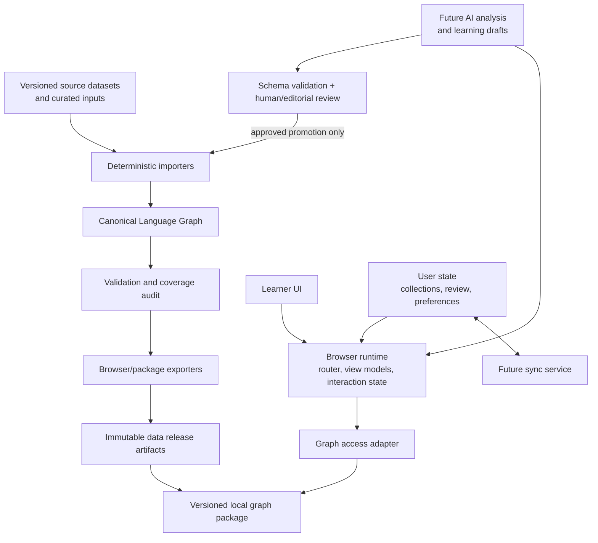

# Liens Architecture Freeze v1.0

**Status:** Adopted

**Scope:** Product and engineering architecture for the next 3–5 years

**Last reviewed:** 2026-07-17

## Purpose

This document freezes Liens' architectural *principles and boundaries*, not its feature set. It is the canonical reference for future work on A2–C2 data, sentence analysis, AI, review, collections, sync, and native clients.

The architecture may evolve only when a concrete decision is documented in `DECISION_LOG.md` and this document is amended. Feature work must not silently create a second data model, bypass provenance, or make the UI depend on an implementation detail of the current prototype.

Liens is a learning-first Language Graph. It is not a conventional dictionary, a parser, or an AI chatbot.

## 1. Architecture review

### What is already strong

| Area | Durable decision |
| --- | --- |
| Identity | Canonical Language Objects have stable, source-independent UUID identities. |
| Knowledge model | Objects, predicate-based Facts, Evidence, typed Relationships, and revisioned Learning Resources separate linguistic truth from teaching content. |
| Source independence | Importers map source records into the canonical graph; no source owns canonical identity. |
| Learning model | Words, forms, senses, grammar, expressions, sentences, conjugation, and pronunciation are navigable graph objects. |
| Provenance | Imports already model source catalog, release, record, run, mapping, evidence, exclusions, and audits. |
| Grammar and morphology | Grammar is first-class; forms resolve to lemmas and paradigms rather than being merely search aliases. |
| AI boundary | AI-generated learning material is distinguishable from canonical linguistic knowledge. |
| Product direction | The browser is designed around exploration of connected learning objects, not database tables. |

### Risks that must not become permanent

| Priority | Risk | Why it fails at scale | Freeze direction |
| --- | --- | --- | --- |
| Blocking | SQLite and browser JSON are committed as ordinary Git files. | Large graph releases bloat history, prevent normal GitHub pushes, and make collaboration expensive. | Treat them as generated, versioned release artifacts once the deterministic build is in place. |
| Blocking | Data reconstruction still has manual steps. | A future import cannot be independently reproduced or audited reliably. | Create one pinned, deterministic data build and an immutable build manifest before expanding significantly beyond A1. |
| Resolved baseline | The browser formerly eagerly loaded one large `wordbank-index.json`. | This would not scale to A2–C2, sentences, media, or mobile networks. | The v1 browser package now uses a compact lookup shell and integrity-hashed, lazy-loaded detail shards; future packages must preserve this contract. |
| High | Learner state is currently local browser state. | Collections, review, accounts, and sync would otherwise duplicate or mutate the shared graph. | Establish a separate user-state domain with canonical UUID references only. |
| High | The current UI is a compact prototype runtime. | Direct DOM rendering and data access in one application module become difficult to test, localize, and evolve. | Introduce view-model, navigation, data-access, and rendering boundaries before major UI growth. |
| High | There is no formal release compatibility contract. | App versions, schema migrations, browser packages, and future clients can drift. | Publish data build IDs, schema/export versions, hashes, and compatibility rules. |
| Medium | Legacy compatibility tables and fields coexist with canonical graph tables. | New features may accidentally depend on transitional representations. | Maintain an explicit ownership/deprecation registry; no new feature may create another parallel truth. |
| Medium | Validation is strong for imported data but not yet a complete CI product gate. | Broken lookup, navigation, and rendering could reach releases even with valid SQL. | Add deterministic build, graph, export-contract, browser, and performance tests to release gates. |
| Medium | Licensing and attribution are documented but not yet a release gate. | Broader source imports increase legal and redistribution risk. | Attach license and attribution checks to every source release and distributable artifact. |
| Future | Privacy, authentication, sync conflicts, and AI telemetry are unspecified. | Retrofitting them after user data exists is costly and risky. | Design these as separate services before accounts or cloud AI are introduced. |

## 2. Product architecture



### Layer responsibilities

| Layer | Responsibility | Must not do |
| --- | --- | --- |
| Learner UI | Present calm learning flows, exploration, accessibility, and user intent. | Expose raw database structure or create canonical knowledge. |
| Browser runtime | Routing, navigation history, view models, cached loading, local user interaction state. | Treat exported indexes as the canonical graph. |
| Graph access adapter | Resolve normalized queries, fetch objects/neighbours, and present stable data contracts to the UI. | Leak SQLite row IDs or exporter-specific formats into UI code. |
| Local graph package | Read-only, versioned distribution of approved canonical knowledge. | Store user-specific review or collection state. |
| Build pipeline | Transform pinned inputs into validated graph and packages reproducibly. | Depend on unrecorded manual edits or live APIs. |
| Canonical graph | Hold approved, evidence-backed linguistic entities, facts, and relationships. | Hold unreviewed AI output or private learner data. |
| Source/curation layer | Preserve source records, licenses, mappings, and editorial additions. | Assign canonical identity based on a source-local ID. |
| Learning layer | Hold human or AI teaching resources and revisions. | Masquerade as canonical linguistic fact. |
| Future AI layer | Analyze, draft, personalize, and explain against graph references. | Directly insert or overwrite canonical graph content. |

Dependencies flow inward: UI depends on stable access contracts; access adapters depend on release packages; packages are generated from the canonical graph; the graph is built from attributable inputs. No outer layer writes directly to an inner authoritative layer.

## 3. Canonical data model

### Content graph

Every canonical object has a UUID that is permanent across imports, releases, source replacements, and client platforms. A database integer such as `language_objects.id` is an internal storage or export adapter only; it is never a public, sync, saved-item, or API identity.

| Object family | Examples | Canonical role |
| --- | --- | --- |
| Lexical object | `prendre`, `cinéma`, `vite` | Lemma-level language unit. |
| Lexical sense | `prendre` = take; `prendre` = buy | An ordered, distinct meaning attached to a lexical object. |
| Inflected form | `vais`, `manges`, `sommes` | A separately navigable form linked to its lemma, morphology, and paradigm. |
| Expression / collocation | `avoir besoin de`, `ce soir` | Multi-word reusable unit with ordered components. |
| Grammar object | present indicative, futur proche, negation | Canonical learnable grammar concept, construction, pattern, or rule. |
| Sentence | an example or curated sentence | Independent object with token/span alignment and graph links. |
| Conjugation object | paradigm, tense, learning group, realization | Structured learning and morphology topology, not a text table. |
| Pronunciation object | pronunciation representation, syllabification, future audio asset | A pronunciation container supporting multiple representations and evidence. Lexique codes are not silently labeled IPA. |
| Media object | future recording, illustration, diagram | Referenced asset metadata; binary delivery is separate from graph identity. |
| Learning resource | explanation, note, memory hint, exercise | Non-canonical teaching content with revisions and one published revision. |

The graph uses three knowledge primitives:

```text
Language Object --has--> Fact --supported by--> Evidence
Language Object --typed relationship--> Language Object
Learning Resource --has--> Learning Resource Revision
```

A Fact is predicate-based: **subject UUID + predicate + typed value + lifecycle**, with one or more Evidence records. Facts such as part of speech, CEFR, pronunciation representation, gender, and frequency are independently attributable and can coexist when sources disagree. Relationships are typed and evidence-backed as well.

Conflicting evidence is preserved, not silently overwritten. Resolution is an explicit canonical-selection policy, recorded through fact status, confidence, editorial review, and release history.

### Non-canonical domains

Collections and review items are not shared Language Objects. They are user-state records that point to canonical UUIDs:

| Domain | Minimum future records |
| --- | --- |
| Identity and preferences | user, device/session, learner preference, language-display preference |
| Collections | collection, collection membership, ordering/tagging metadata |
| Review | review item, schedule/state, review event, answer/assessment metadata |
| Progress | learner progress, goal, activity event, optional derived summary |
| Sync | append-only client operation/outbox, server acknowledgement, conflict record |
| AI Learning Database | learner-scoped AI Learning Resource revisions, provider/model provenance, lifecycle state, and normalized unknown-lookups; never canonical graph claims |

User state may add personal notes, but it must never duplicate or mutate canonical facts. Sync conflicts need an explicit policy per record type; canonical content remains release-controlled and read-only to clients.

### Analysis boundary

Future sentence analysis creates an analysis instance containing input text, token spans, candidate matches, confidence, and grammar/relationship references. It is an interpretation of a learner input, not a canonical sentence or a source of linguistic truth. It may reference canonical UUIDs and Learning Resources, but cannot directly create or overwrite them.

## 4. Canonical build architecture

The repository must eventually contain the *recipe*, not ordinary copies of every built database.

### Version-controlled inputs

- SQL schemas and migrations;
- importer and exporter code;
- source manifests: source, release/version, license, acquisition location, checksum, expected format, and attribution requirements;
- curated additions and editorial review records;
- transformation rules and deterministic derivation rules;
- validation, coverage, and audit specifications;
- documentation and release configuration.

### External or cached inputs

Raw upstream datasets may be cached locally or in controlled artifact storage after checksum verification. They are not implicitly trusted merely because they are present on a developer machine.

### Generated outputs

SQLite graph files, browser indexes, search shards, compressed packages, reports, and release manifests are generated outputs. They should be published as immutable release assets or object-storage artifacts with checksums. Git LFS can be used as a temporary developer cache only if needed; it is not the canonical source of linguistic truth or the primary production distribution mechanism.

### Required deterministic pipeline

```text
bootstrap schema/migrations
→ verify pinned source artifacts and licenses
→ import source records and mappings
→ create/update canonical objects, facts, evidence, and relationships
→ run explicit deterministic derivations
→ validate graph, provenance, coverage, and licenses
→ export versioned browser/client packages
→ validate export contracts and product flows
→ emit immutable build manifest and release artifacts
```

Each release manifest must identify at least:

- data build ID and creation time;
- schema and migration set;
- importer/exporter versions or source revision;
- input source release IDs and checksums;
- artifact hashes and sizes;
- validation/coverage/audit result;
- licensing and attribution payload;
- browser export contract version.

The current pipeline has useful importers, manifests, validation, and audits, but still requires manual source preparation and has no single end-to-end build command or release manifest. That is an acknowledged gap. Before generated artifacts are removed from Git or A2 is materially expanded, Liens must implement and verify this build/release foundation.

## 5. Source provenance policy

| Source class | Intended canonical contribution | Policy |
| --- | --- | --- |
| FLELex | CEFR, lexical category, frequency and related lexical metadata | Preserve release identity, license, source record, and transformations. |
| Lexique | Forms, morphology, phonological-code and syllabification representations | Preserve representations exactly; do not relabel a phonological code as verified IPA. |
| Kaikki / Wiktionary-derived data | Source-backed senses, English glosses, selected examples, relations, and multi-word material where license permits | Preserve entry/sense identity, license and attribution; curate selection and ordering explicitly. |
| Curated grammar sources | Grammar topology, relationships, prerequisites, contrasts, and teaching structure | Record editor, source/citation, review status, and evidence per claim. |
| Manually curated data | Gaps or quality corrections supported by editorial review | Treat as a first-class versioned source release, never an anonymous database edit. |
| AI-generated drafts | Proposed explanations, notes, analyses, candidate mappings, or candidate facts | Never canonical until reviewed and promoted through an explicit import/review action. |

Every import is reproducible from a source release and mapping. Every fact and relationship must have provenance. Derivations must identify their input facts and rule version. Source disagreement is represented explicitly rather than discarded.

## 6. AI architecture: analysis and drafts, never hidden truth

AI is a Learning Layer and analysis assistant. It can make Liens more understandable, but it cannot be the untracked authority behind a page.

```text
learner request or editorial task
→ AI draft / analysis result
→ schema validation and provenance capture
→ review queue
→ human/editorial decision
→ approved promotion through versioned importer
→ canonical graph release
```

For every AI draft, retain the model/provider, model version where available, prompt/template version, tool and source context, input/output hashes, timestamp, safety/evaluation result, and reviewer decision. Sensitive learner input must follow a future privacy policy before it leaves a device.

AI may:

- explain matched canonical objects in learner-appropriate language;
- create draft Learning Resource revisions;
- identify candidate words, forms, expressions, grammar concepts, or sentence links;
- suggest gaps for editorial review;
- personalize presentation using user-authorized learning state.

AI may not:

- directly write canonical objects, facts, evidence, or relationships;
- overwrite curated data;
- present generated assertions as curated facts;
- silently promote a parser or model output into a source-backed release.
- infer a named grammar construction in learner-facing guidance unless the deterministic analysis supplied that canonical Grammar Object as a match.

The browser may retain AI Learning Resources in a separate learner-scoped IndexedDB database. That database is not a canonical store: canonical resources take precedence, active AI resources prevent duplicate provider calls, and later canonical coverage supersedes rather than deletes an AI record.

## 7. Browser and client architecture

### Current state

The static browser application now loads a generated versioned data package: a compact normalized lookup bootstrap plus 64 deterministic, integrity-hashed Language Object detail shards. It resolves lookup and deterministic sentence analysis locally, then fetches and caches only the details required by the learner's current exploration. SQLite remains the upstream graph source.

### Frozen target

The browser consumes a versioned **data package**, never source files or an arbitrary SQLite schema. A graph access adapter gives UI code stable operations such as resolve query, get object, get senses, get neighbours, get paradigm, and get sentence analysis references.

For scale, data packages should contain:

- a compact bootstrap manifest and normalized lookup index;
- sharded object payloads and neighbour/relationship payloads, partitioned predictably by type and/or key range;
- precomputed search structures appropriate to supported search modes;
- optional progressive offline packs by level, feature, or language;
- cache metadata and integrity hashes.

The browser should eagerly load only enough to open the home experience and resolve a typical query. Object detail, graph neighbours, sentence data, media, and large search structures load on demand and are cached. Before implementing the new exporter, the project must agree measurable initial-load, lookup, navigation, memory, and offline-storage budgets for web and mobile targets.

Web, desktop, and mobile clients should share the same content package contract and canonical UUIDs. Platform-specific storage engines are adapters, not new content models.

## 8. Release architecture

| Concern | Long-term owner |
| --- | --- |
| Git repository | Source code, schema, manifests, curated inputs, tests, docs, and build recipe. |
| Data release | Immutable graph and client packages, audit reports, attribution, checksums, and build manifest. |
| Web release | Versioned application assets plus an explicit compatible data-build range. |
| Desktop/mobile release | Platform application package plus compatible local data package/update strategy. |
| User-state service | Future authenticated sync, review, collections, and private data; separate from public graph releases. |

Application version and data build version are independent. A release must declare compatibility in both directions and support safe rollback to a previously verified data package. Data migrations are additive or explicitly version-gated; no client may assume an unannounced schema shape.

## 9. Engineering principles and mandatory gates

1. Canonical UUIDs are the only durable identifiers outside storage adapters.
2. Preserve graph integrity: no orphaned approved objects, facts, evidence, or relationships.
3. Preserve provenance and licenses for every canonical claim and distributable source-derived asset.
4. Reproducibility is a product feature: an approved release must be rebuildable from pinned inputs and documented rules.
5. Generated artifacts are releases, not hand-edited source code.
6. AI drafts and analyses are clearly labeled, reviewable, and never hidden canonical truth.
7. User state is separate, private, and references the graph rather than copying it.
8. UI presents learning objects and learning flow, never raw database structure.
9. New features extend the graph or its stable adapters; they do not bypass them with special-case stores.
10. Compatibility adapters may exist, but must have an owner, migration path, and retirement condition.
11. Every release validates the graph, exporter contract, key user journeys, source licensing, and artifact integrity.
12. Documentation changes only when system reality changes, following the Documentation Audit policy.

Required quality gates for a production data release are:

- migration/schema verification and foreign-key integrity;
- source checksum, license, attribution, coverage, and exclusion audit;
- zero orphan and duplicate-identity checks;
- deterministic import/export validation and build-manifest verification;
- browser export-contract tests plus search, navigation, and rendering regressions;
- release artifact checksum and compatibility validation;
- privacy/security review before accounts, sync, or remote AI handling is introduced.

## 10. Post-freeze sequence

1. **Data Build and Release Foundation:** make the entire graph reproducible, create release manifests, and stop treating generated graph artifacts as ordinary Git history.
2. **Browser Data Access Evolution:** introduce the access adapter and package/shard strategy while preserving current UI behaviour.
3. **Learner State Boundary:** design collection, review, progress, and sync contracts independently from canonical data.
4. **AI Draft and Review Workflow:** implement controlled learning-resource and canonical-change proposal paths only after governance, privacy, and evaluation rules are testable.
5. **A2 and beyond:** expand source-backed data through the frozen build pipeline, not by prototype-only additions.

This sequence deliberately prioritizes reliable foundations over feature count. It keeps the current A1 Golden Slice valuable while ensuring that the next million objects, future clients, and future AI capabilities remain compatible with the same Language Graph.
