# Liens

## Product & Architecture Book

> **French, understood as a connected system.**
>
> Liens turns a lookup into a path: word → form → meaning → grammar → example → the next useful idea.

---

## 1. The idea in one page

French learning is usually fragmented: a dictionary for definitions, a conjugator for forms, a grammar site for rules, flashcards for review, and a chatbot for explanations. Liens brings those moments together without pretending that a chatbot is the product.

Liens is a **local-first language learning environment** built on a connected, evidence-backed Language Graph. It is not a dictionary, translator, course, or AI chat window. A learner starts anywhere—an unfamiliar word, an inflected form, or a sentence—and remains inside one calm, explorable system.

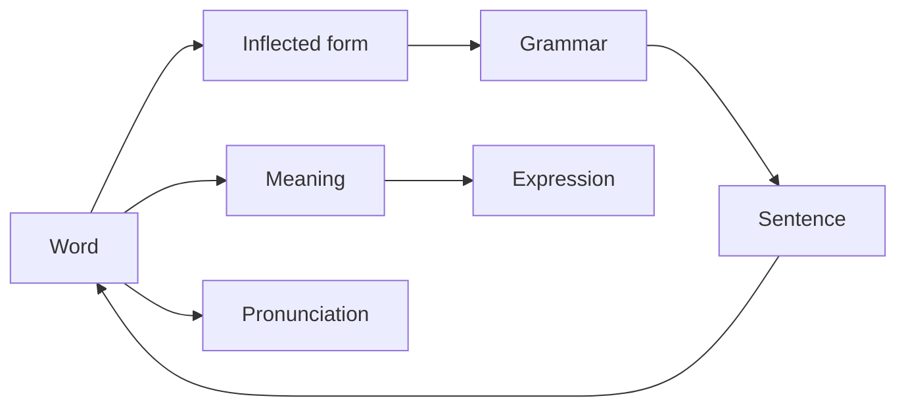

### The product promises

| Promise | What it means in practice |
| --- | --- |
| Teach, not merely define | Show meaning in context, patterns, forms, and useful next connections. |
| Trust structure | Canonical linguistic knowledge has source evidence and does not come from an LLM. |
| Never strand the learner | When teaching content is missing, clearly labelled AI learning drafts can help. |
| Preserve context | A word remains the visual anchor while its meanings expand in place. |
| Stay calm | Spacious pages, small purposeful actions, and no “database browser” feeling. |

---

## 2. What makes Liens different

### ⭐ A graph, not a pile of entries

Every meaningful unit is a Language Object: a word, sense, form, expression, grammar concept, sentence, conjugation pattern, or pronunciation. Their links create the learning path.

### ⭐ Facts are separate from sources

Liens does not say “a source owns a word.” A stable object owns an evidence-backed fact: *prendre* → `part_of_speech` → `verb`, supported by a specific source release. This keeps identities stable while sources can improve or disagree.

### ⭐ Grammar has its own place

Présent, futur proche, agreement, pronouns, negation, and constructions are navigable objects—not AI labels pasted onto a sentence.

### ⭐ AI completes teaching; it does not rewrite language

AI can make an empty learning slot useful: an explanation, a Chinese reference note, a memory tip, or a contextual sentence reading. It cannot create canonical objects, facts, or relationships.

### ⭐ Personal learning is separate from shared knowledge

Saves, collections, and review events belong to the learner. They never contaminate the shared graph and can evolve independently.

---

## 3. How Liens got here

| Chapter | Decision | Why it mattered |
| --- | --- | --- |
| Prototype | Search opened directly into learning pages. | Removed the “search results first” dead end. |
| Graph foundation | Words, forms, expressions, grammar, and sentences became objects. | Made infinite exploration possible. |
| Evidence model | Stable UUIDs, predicate facts, and evidence replaced source-shaped records. | Preserves identity across imports and future source changes. |
| Golden slice | A1–C2 became an imported graph, not a hand-built demo list. | Proved the production pipeline before further features. |
| Learning layer | AI drafts live in a separate local database. | Gives help without weakening trust. |
| Personal layer | Saves and collections became learner-owned records. | Supports review without turning Liens into Anki. |
| Native navigation | Back/Forward behaves like a focused app; Home starts fresh. | Keeps exploration understandable. |

Alternatives deliberately rejected: a flat dictionary schema, one enormous browser JSON file, AI-generated canonical facts, and a chatbot as the primary interface.

---

## 4. Evolution of Liens

Liens did not begin as a graph project. It began with a simple but demanding question: *can French learning stop forcing a learner to leave one tool for another?* This is the design history of the answer.

### 1 — From a demo dictionary to a learning-first product

**The original problem.** The first project was a small French lookup demo with a limited word list. It could show a word, but it could not support the actual moment of learning: seeing a form in a sentence, understanding why it appears there, hearing it, saving it, and returning to it later. **Why the common answer was insufficient.** A conventional dictionary solves reference, not learning; a chatbot solves a momentary question but does not preserve a dependable structure. **Alternatives considered.** We could have expanded the demo word list, embedded an AI chat panel, or copied a dictionary-style multi-page design. Each would have made the prototype look richer while keeping the learner’s experience fragmented. **The choice.** Liens became a learning environment governed by `Learn → Explore → Save → Review`. **Why.** The product had to make connections, not pages, the primary unit of experience. **What this enabled.** Every later choice—graph, sentences, personal learning, and AI—could be judged by whether it improved that continuous loop.

### 2 — From words as records to Language Objects as a graph

**The original problem.** Treating *venir*, *viens*, *avoir besoin de*, a grammar construction, and an example sentence as unrelated record types created immediate dead ends. A learner who opened *sommes* needed to reach *être*, its tense, examples, and related grammar; a word table could not express that naturally. **Why the common answer was insufficient.** Most vocabulary products attach inflections and examples as fields under a word, while grammar sites and sentence tools are separate products. That prevents any of them from being first-class destinations. **Alternatives considered.** Separate vocabulary/grammar/sentence databases, page-specific JSON, or a word table with hand-written “related” links. They would have accumulated special cases at every new feature. **The choice.** Every meaningful language element became a Language Object with typed relationships. **Why.** One identity model lets any object participate in the same learning flow. **What this enabled.** Forms, expressions, grammar, pronunciation, sentences, collocations, and future exercises can be added as data and connections rather than as isolated product silos.

### 3 — From source-shaped imports to permanent canonical identity

**The original problem.** A prototype database can take an importer’s row ID as identity. A durable learning platform cannot: sources change, records are replaced, and learner saves must survive. We also discovered that a word can have one source for CEFR, another for IPA, and another for senses. **Why the common answer was insufficient.** A single source column on an object cannot explain which source supports which claim, nor can it represent a disagreement without overwriting something. **Alternatives considered.** Auto-increment IDs, importer-generated UUIDs, object-level provenance only, or a “best current value” field. These all made migration, conflict review, and durable personal links fragile. **The choice.** Liens adopted permanent source-independent UUIDs and the model `Language Object → predicate Fact → Evidence`; relationships have their own evidence as well. **Why.** Identity must belong to the graph, while sources support claims within it. **What this enabled.** Replaceable importers, multiple evidence-backed facts, explicit disagreement, stable APIs, and personal collections that survive future source upgrades.

### 4 — From a dictionary schema to senses, multi-word structure, and grammar

**The original problem.** A definition string could not distinguish *prendre* “to take” from *prendre* “to buy,” link an example to the right meaning, or let a learner save one meaning rather than the entire word. Likewise, an expression’s display text could not preserve component order, and sentence grammar was at risk of becoming a transient AI label. **Why the common answer was insufficient.** Dictionary interfaces often flatten senses into prose; grammar apps store rules in a separate course tree; many language models re-identify grammar from scratch on every request. **Alternatives considered.** Keep definitions as blobs, make every sense a heavy standalone page, store expression components in JSON, or let AI dynamically name grammar. **The choice.** Lexical senses, multi-word objects with ordered components, and grammar concepts all became canonical objects. Senses render inside their owner word so the lemma remains the anchor. **Why.** The graph needs precise identity; the learner needs calm context. **What this enabled.** Sense-aligned examples, grammar pages with prerequisites and contrasts, reliable expression matching, and future review of a particular meaning or construction.

### 5 — From a tiny wordbank to reproducible source-backed coverage

**The original problem.** “Add all A1 words” exposed a critical distinction: a larger list is not a production foundation. Function words, prepositions, forms, frequency, definitions, and coverage gaps all mattered as much as familiar nouns and verbs. **Why the common answer was insufficient.** Hand-curated demo lists and LLM-generated vocabulary are fast but cannot prove what they cover, reproduce an import, or scale credibly to B2 and beyond. **Alternatives considered.** Hard-code a target count, merge data directly into the app, or let AI fill canonical gaps. They would have made the product appear complete while hiding its weakest data. **The choice.** Import pinned, attributable releases through a source-independent pipeline: FLELex/Beacco for CEFR and frequency, Lexique and Morphalou for morphology, Kaikki/Wiktionary material for senses and examples, and curated sources for grammar. **Why.** Coverage must be measured against a source release, not claimed from a demo. **What this enabled.** A1–C2 release builds, honest exclusion reports, repeatable audits, and an architecture capable of adding later datasets without redesign.

### 6 — From conjugation tables to graph-native morphology

**The original problem.** Early conjugation showed only scattered present forms and participles, often in database order. Even a regular A1 verb such as *manger* could display a teaching shell with no usable forms; clicking a form did not always open its own page. **Why the common answer was insufficient.** Static conjugation tables duplicate strings, hide a form’s identity, and require UI changes every time a new tense is added. Giant tense dropdowns also treat learning progression as a database filter. **Alternatives considered.** Hard-code paradigms for popular verbs, generate forms from rules without evidence, or keep one raw table ordered by grammatical metadata. **The choice.** Inflected forms are Language Objects linked to lemmas and evidence-backed paradigms; the UI uses learning groups, canonical pronoun order (`je`, `tu`, `il / elle / on`, …), and verb-group teaching metadata. **Why.** A conjugation should be both a learning path and a graph traversal surface. **What this enabled.** Clickable forms, source-backed simple morphology at scale, future tense data as imports rather than UI work, and sentence resolution through forms.

### 7 — From “IPA everywhere” to honest pronunciation representations

**The original problem.** A form may not sound like its lemma, while the browser could pronounce a word even when Liens had no verified IPA. Calling every available phonetic value IPA would have misled the learner. **Why the common answer was insufficient.** Many apps have one opaque pronunciation field or treat cloud/browser speech as proof of a canonical pronunciation. That erases source differences and regional variants. **Alternatives considered.** Reuse lemma IPA for forms, convert Lexique codes invisibly, store only audio, or rely solely on browser TTS. **The choice.** Each object owns a source-independent Pronunciation Object with parallel Kaikki IPA, Lexique phonological code/syllables, audio metadata, and visibly derived Lexique IPA when appropriate. Browser synthesis is a separate playback fallback. **Why.** Useful delivery and verified linguistic evidence are different concerns. **What this enabled.** Honest coverage, pronunciation variants, future cached recordings/local TTS, and better source upgrades without breaking a learner’s page.

### 8 — From sentence lookup to the Sentence Intelligence gateway

**The original problem.** Learners do not only search headwords; they paste “Je vais au cinéma ce soir.” The first local sentence view could tokenize text and label newly seen tokens, but it lacked translation and teacher-like explanation. **Why the common answer was insufficient.** Exact sentence search only helps with preloaded examples. A parser-only screen exposes technical analysis; a chatbot-only answer can be fluent yet disconnect from existing words and grammar. **Alternatives considered.** Treat every input as a word search, send all text to AI, or build a fully general parser before the graph was ready. **The choice.** Sentence Intelligence performs deterministic local resolution first: normalize, find lemmas/forms/expressions/contractions, identify supported canonical grammar, and render graph links. Contextual teaching can then use the result. **Why.** The sentence is a gateway into durable knowledge, not an answer that disappears. **What this enabled.** Traceable sentence pages, increasingly rich local coverage, and AI explanations constrained by known matches rather than invented grammar truth.

### 9 — From an awkward word page to anchored meaning exploration

**The original problem.** Opening a sense as a new generic page produced titles such as “prendre · to get; to buy.” It visually suggested that the learner had left *prendre*, wasted the strongest anchor, and made meaning navigation feel like browsing a database. **Why the common answer was insufficient.** Heavy tabs hide content behind another navigation model; a long list of fully expanded senses overwhelms; separate pages fragment reading flow. **Alternatives considered.** A sense route with a giant heading, tabs, or one enormous definitions panel. **The choice.** The lemma stays large and stable. A compact Meanings section expands one sense in place, shows the most common senses first, and reveals examples, collocations, and notes progressively. **Why.** The learner is exploring one word with several lives, not opening unrelated entries. **What this enabled.** Direct sense identity still works for links and saves while the UI remains premium, calm, mobile-friendly, and ready for richer sense-level resources.

### 10 — From browser back buttons to native exploration

**The original problem.** The app accumulated page-level Back controls; opening a vocabulary entry could inherit scroll position, and going Back made it impossible to return Forward without losing context. This made graph exploration feel unreliable. **Why the common answer was insufficient.** Browser history is infinite and exposes implementation mechanics; page-specific buttons duplicate the same action; naive rerendering loses selected sense, filters, and scroll. **Alternatives considered.** Keep a Back button on every page, let the browser own all history, or reset every destination. **The choice.** Liens uses one branch-based, Apple-like Back/Forward path in the persistent header. It restores view state, clears Forward when a new branch begins, and lets Home/Logo reset the session. **Why.** Learners should navigate language, not think about history stacks. **What this enabled.** Deeper graph journeys, preserved Vocabulary Library context, consistent mobile behavior, and a design language closer to Finder or Apple Music than a web browser.

### 11 — From “Vocabulary Notebook” ambiguity to two learning surfaces

**The original problem.** “Vocabulary Notebook” initially became a useful saved-items view, but that was not the same need as browsing the complete local vocabulary. Learners needed both discovery by CEFR and a personal memory trail. **Why the common answer was insufficient.** Dictionary indexes are not learner paths; flashcard apps usually treat global catalog and saved cards as the same thing. **Alternatives considered.** One giant scrolling word list, a second copied dictionary database, or a generic saved-item store that discarded object type. **The choice.** The Vocabulary Library queries the canonical graph by CEFR, part of speech, and frequency with pagination; the Notebook holds typed learner-owned pointers, collections, and review events. **Why.** Shared knowledge and personal learning have different ownership and different jobs. **What this enabled.** Frequency-first discovery from A1–C2, calm card/list revisiting, type-aware saves, and future graph-based review without duplicating canonical content.

### 12 — From optional AI button to a complete Learning Layer

**The original problem.** A mature graph still leaves empty teaching slots—especially explanations, Chinese reference help, usage notes, and unknown words. Requiring the learner to request every missing resource made the product feel incomplete; generating everything immediately wasted tokens and overloaded pages. **Why the common answer was insufficient.** Chat bubbles make AI a separate destination, repeat context, and encourage unbounded output. Pure local coverage leaves silent empty pages. **Alternatives considered.** No AI, one generic `generate(prompt)` API, an always-on chatbot, or AI directly enriching canonical facts. **The choice.** Liens requests typed learning resources in context. Known pages generate compact help progressively; unknown lookups receive one bounded provisional note first; resources are language-aware, clearly labelled, and cached. **Why.** The graph guarantees correctness while the Learning Layer strives for completeness without pretending drafts are facts. **What this enabled.** In-place sentence explanations, English plus optional Chinese resources, controlled costs, improved prompts without UI redesign, and a path to teacher/human authored resources.

### 13 — From localStorage drafts to a durable AI Learning Database

**The original problem.** Early generated content survived only in browser cache behavior that was too weak for revisions, provenance, search, or source replacement. Gemini could also be busy, making repeated requests both costly and unreliable. **Why the common answer was insufficient.** LocalStorage is not a learning-content store; a provider response with no lifecycle is neither reusable nor auditable. **Alternatives considered.** Save AI output into canonical SQLite, regenerate on every visit, or keep opaque blobs on individual word pages. **The choice.** A dedicated IndexedDB AI Learning Database stores target/kind/context/language identity, revisions, provider/model/prompt version, timestamps, lifecycle, and recent unknown lookups. Resolution is canonical → active AI resource → online generation; later canonical content supersedes, but does not erase, drafts. **Why.** Reuse must be permanent enough to help the learner and isolated enough to preserve the graph. **What this enabled.** Lower API cost, offline reuse of prior help, bounded prebuilt learning packs, future regeneration/history, provider comparison, and an editorial promotion workflow.

### 14 — From a hackathon repository to a product that can survive handover

**The original problem.** The prototype’s data artifacts grew into gigabytes, while major decisions lived partly in conversation and partly in code. That was not sustainable for A2–C2, collaboration, or a future production release. **Why the common answer was insufficient.** Keeping generated SQLite/browser assets in ordinary Git inflates history; README-only knowledge loses the reasons behind boundaries. **Alternatives considered.** Git LFS as the default source of truth, a monolithic manual, or relying on commits and chat history. **The choice.** Architecture Freeze v1.0 established generated-artifact boundaries: version control keeps schemas, manifests, importers, audits, curated inputs, and build configuration; releases are reproducible external artifacts. This book captures the product reasoning, while concise living contracts retain precision. **Why.** A future engineer needs both the recipe and the judgment behind it. **What this enabled.** Scalable releases, clean repository hygiene, future native clients, reliable source updates, and a shared intellectual foundation for Liens beyond the original build.

---

## Design Rationale — the stories behind the system

These are not implementation rules. They record the learner problems that made Liens choose its shape.

### The Language Graph

**Problem discovered.** Looking up *sommes* used to lead to an isolated definition or a failed search, while the learner needed *être*, its present-tense form, and examples. **Why the usual answer fails.** Dictionaries keep forms, meanings, grammar, and examples in separate reference views; flashcard apps flatten them into disconnected cards. **Alternatives rejected.** A larger word table and hard-coded cross-links would have looked complete but broken as coverage grew. **Liens’ choice.** Every meaningful element is a typed, connected object. **USP.** Exploration continues naturally from a form to its lemma, grammar, expression, or sentence. **Future enabled.** Relationship-aware review, richer sentence analysis, and new object types can arrive without changing the learning metaphor.

### Evidence-backed canonical knowledge

**Problem discovered.** Linguistic sources overlap, disagree, and evolve; tying an object’s identity to one importer made saved learning fragile. **Why the usual answer fails.** Many learning products hide their sources or overwrite an old value with a new one, leaving no way to understand a conflict. **Alternatives rejected.** Source-specific IDs and a single “best” text field. **Liens’ choice.** Stable UUID object → predicate fact → evidence. **USP.** Liens can say what it knows, why it believes it, and still preserve a learner’s saved link across imports. **Future enabled.** Conflict resolution, editorial review, commercial datasets, and public APIs without data migration trauma.

### Local-first browser graph

**Problem discovered.** A learning lookup should feel immediate, including on weak or absent connectivity; loading a giant export made the prototype slow and brittle. **Why the usual answer fails.** Cloud dictionaries make every tap a request, while monolithic offline bundles punish first load. **Alternatives rejected.** A browser reading SQLite directly or one giant JSON dictionary. **Liens’ choice.** A generated static lookup index with integrity-checked lazy detail shards. **USP.** Fast local resolution with a package that can grow beyond a demo. **Future enabled.** Desktop/mobile packaging, offline releases, incremental package updates, and large multilingual graphs.

### Sentence Intelligence as a gateway

**Problem discovered.** Learners paste real French, not neat dictionary headwords, but a sentence page that only tokenizes text feels empty and untrustworthy. **Why the usual answer fails.** Parser-first products show technical trees, while chatbots produce fluent explanations that may invent the underlying analysis. **Alternatives rejected.** Exact-sentence lookup and letting an LLM decide every grammatical truth. **Liens’ choice.** Deterministic local resolution of forms, contractions, expressions, and supported grammar objects first; AI explains only after matching. **USP.** A sentence opens the graph rather than becoming a one-off answer. **Future enabled.** Increasingly capable parsing with stable grammar pages and auditable confidence.

### AI Learning Layer, not AI knowledge

**Problem discovered.** Local coverage will never make every page feel fully taught, yet silently filling gaps with AI destroys trust. **Why the usual answer fails.** Chatbots forget context and repeat token costs; AI-first dictionaries blur generated prose with source-backed facts. **Alternatives rejected.** No AI at all, or AI writes directly into the graph. **Liens’ choice.** Typed, language-aware learning resources in a separate IndexedDB with provenance, prompt version, revision, and replacement rules. **USP.** Liens can be helpful now and more trustworthy later: curated content automatically outranks a cached draft. **Future enabled.** Provider switching, quality experiments, human review, multilingual teaching, and safe regeneration.

### Pronunciation as representations

**Problem discovered.** “No IPA” was confusing when browser TTS could still speak a word; treating every notation as IPA would create false certainty. **Why the usual answer fails.** Most apps show one opaque phonetic string or equate playback with verified pronunciation. **Alternatives rejected.** Copying a lemma’s sound to each form, converting source codes invisibly, or storing only audio. **Liens’ choice.** A Pronunciation Object holds parallel Kaikki IPA, Lexique codes/syllables, derived representations, and audio metadata, each labelled by provenance. **USP.** Learners receive useful playback without mistaking it for canonical evidence. **Future enabled.** Cached recordings, local TTS, regional variants, and corrected sources without redesign.

### Personal learning, library, and review

**Problem discovered.** “Vocabulary” meant two different needs: browse the whole language and revisit what *I* chose. **Why the usual answer fails.** Traditional apps mix a global dictionary with saved cards, then force every object into the same flashcard scheduling model. **Alternatives rejected.** One generic saved-item list or a separate duplicate dictionary UI. **Liens’ choice.** The Vocabulary Library browses canonical CEFR objects; the Notebook stores typed personal pointers, collections, and lightweight review events. **USP.** Learners can discover broadly while retaining a meaningful personal trail. **Future enabled.** Graph-based review prompts—word ↔ form ↔ sentence ↔ grammar—rather than isolated cards.

### Calm, native exploration

**Problem discovered.** Deep graph navigation easily turned into stacks of giant titles, duplicate back buttons, and lost scroll positions. **Why the usual answer fails.** Browser-like history exposes mechanics; tab-heavy dictionary screens make a word feel like a dashboard. **Alternatives rejected.** A separate page for every lexical sense and infinite browser history. **Liens’ choice.** The lemma stays anchored, senses expand in place, and one Apple-like Back/Forward path preserves state; Home starts a new session. **USP.** The graph feels like one continuous language, not a database of destinations. **Future enabled.** Deeper relationship journeys without cognitive overload on mobile or desktop.

---

<div style="break-before: page; page-break-before: always;"></div>

## 5. The system at a glance

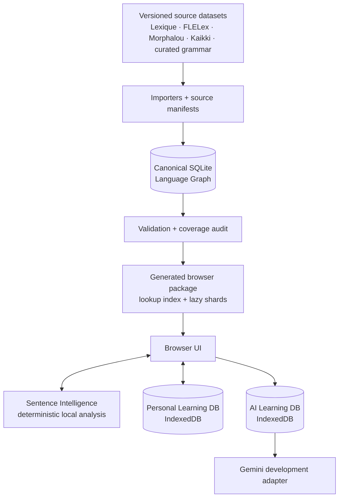

| Layer | Owns | Never does |
| --- | --- | --- |
| Browser UI | Reading, exploration, settings, navigation. | Treat generated UI state as linguistic truth. |
| Canonical Graph | Object identity, facts, evidence, typed relationships. | Accept hidden AI writes. |
| Build pipeline | Imports, validation, repeatable release generation. | Hand-edit generated artifacts. |
| Browser package | Fast, static, lazy local lookup. | Replace canonical SQLite. |
| AI Learning DB | Cached drafts, revisions, provenance, recent unknown lookups. | Become canonical knowledge. |
| Personal Learning DB | Saves, collections, review events. | Change shared data. |

---

## 6. The language model

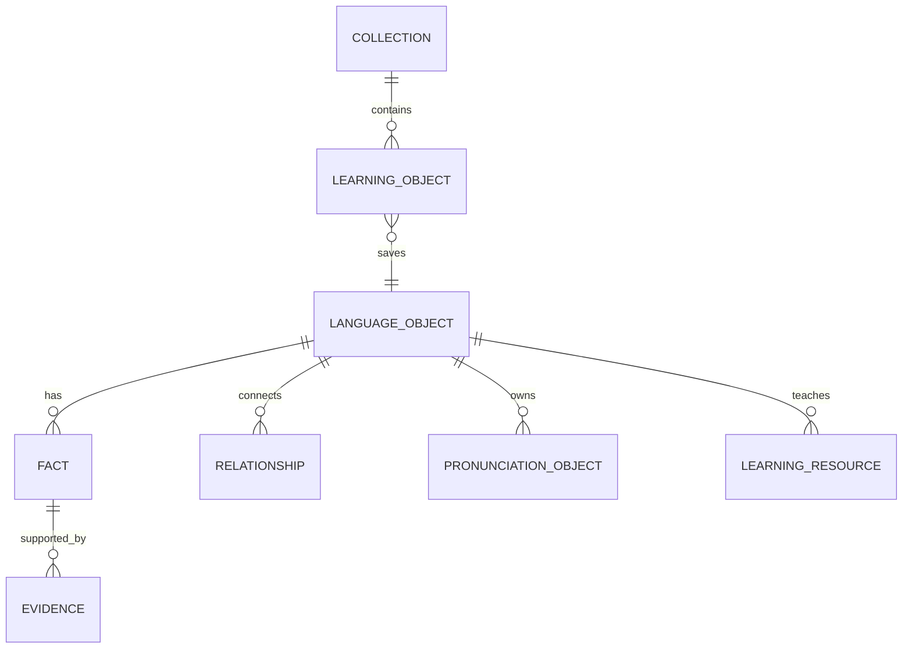

| Object | Learner meaning | Important rule |
| --- | --- | --- |
| Language Object | The durable identity of *aller*, *vais*, futur proche, or an expression. | UUIDs are source-independent and permanent. |
| Fact + Evidence | A claim and its attributable support. | Facts use predicates; evidence is not attached vaguely to the object. |
| Relationship | A typed edge such as `inflected_form_of`, `expresses`, or `governs_preposition`. | It is evidence-backed canonical graph knowledge. |
| Lexical Sense | One learnable meaning under a word. | It expands under the lemma rather than becoming a heavy new destination. |
| Pronunciation Object | Several parallel representations: Kaikki IPA, Lexique phonological code, syllables, audio metadata. | Derived Lexique IPA is explicitly derived; browser TTS is playback only. |
| Learning Resource | Explanation, example, Chinese reference note, tip, or comparison. | It has language, provenance, revision, and lifecycle. |
| Learning Object | A learner’s saved pointer to an object/sense/sentence/grammar item. | Personal, never shared graph data. |

---

## 7. When a learner searches

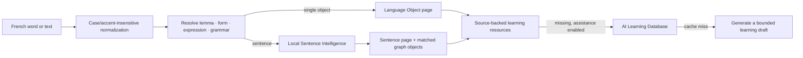

The original query is preserved for display. The canonical spelling is preserved for the object: `etre` resolves to **être**, not to a duplicate entry. An inflected form such as **sommes** opens its own object and states that it is an inflected form of **être**.

Sentence Intelligence is intentionally modest and deterministic. It identifies high-confidence forms, contractions, expressions, and supported grammar objects first. AI can explain those matches; it does not quietly invent them.

---

## 8. Core Runtime Flows

This is Liens’ operational blueprint. The diagrams describe the intended durable runtime, not merely a code path in the current browser prototype. **Implemented now** marks behaviour available today; **next evolution** marks a boundary that is already designed but not yet fully built.

### Runtime invariants

- **Canonical knowledge is read-only at runtime.** No browser action, parser, or provider call can create a canonical object, fact, evidence record, or relationship.
- **Learning content is replaceable.** Curated/source-backed content wins; AI drafts are retained with provenance and can be superseded, not silently promoted or erased.
- **Personal state is learner-owned.** Saving or reviewing an object creates a personal pointer and events, never a second copy of language data.
- **Local analysis precedes online help.** The graph is useful without Gemini; AI fills a teaching gap rather than becoming the route to meaning.
- **The learner stays in context.** A flow resolves into the existing word, form, grammar, or sentence surface rather than an external chatbot or duplicate page.

<div style="break-before: page; page-break-before: always;"></div>

### 8.1 Word Search Flow

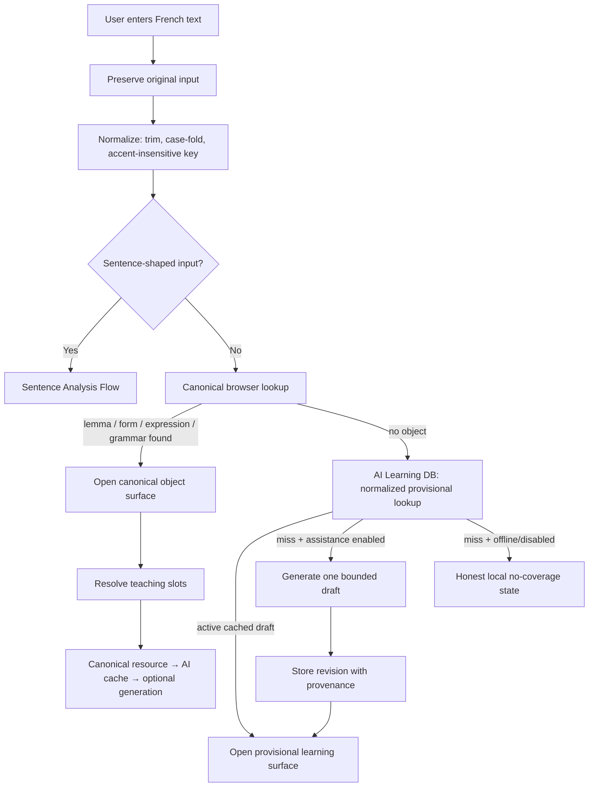

**Steps.** Input retains its original spelling for the learner, but a normalized key makes `etre`, `ÊTRE`, and `être` resolve to the same canonical object. The graph lookup checks canonical lemmas, forms, expressions, and appropriate grammar objects. A form opens its own object and points to the lemma; it is not substituted with the lemma. If no object exists, Liens first checks the learner-local AI database for the same normalized provisional lookup. Only a true miss can use online assistance, and it produces one compact note—not an invented full dictionary entry. Once an object is open, each missing teaching slot resolves independently: source-backed/curated resource first, then cached AI resource, then an allowed generation.

**Why this shape.** The early prototype risked treating every lookup as either a hard “not found” or a fresh AI request. Common dictionaries usually require exact accents or expose a search-results page; chat products make every word a new conversation and pay the cost again later. We rejected duplicate no-accent objects, an intermediate results page, and automatic generation of a whole entry for unknown text. Liens instead separates *resolving language identity* from *filling learning content*.

**USP.** Search is forgiving and immediate without corrupting canonical spelling or trust. The same query becomes cheaper and more useful over time because learning drafts are reusable. **Next evolution:** a server/desktop graph adapter can replace the static browser lookup without changing this resolver contract; reviewed source imports supersede a matching provisional draft automatically.

<div style="break-before: page; page-break-before: always;"></div>

### 8.2 Sentence Analysis Flow

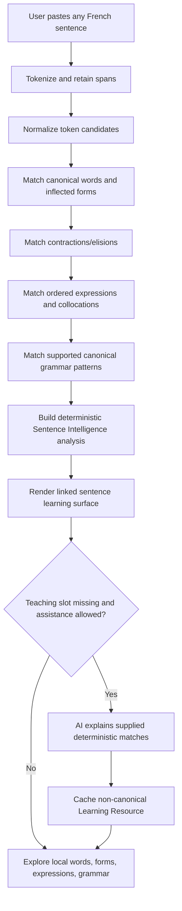

**Steps.** Tokenization preserves the learner’s exact text and character spans. Local matching resolves forms to lemmas, recognizes selected contractions such as `au` and `du`, then checks multi-word sequences before grammar patterns. Sentence Intelligence assembles these evidence-backed observations into a non-canonical analysis instance. The page links every confident match back to its Language Object. AI receives that structured analysis as context and can explain *why* a matched tense or construction is used; it may not add a named grammar construction that the deterministic layer did not match.

**Why this shape.** A sentence page that only breaks text into chips is not teaching, but a free-form AI parsing answer has no durable links or reliable boundary between observation and invention. We rejected exact-sentence-only lookup, a syntax-tree-first UI, and “ask the LLM to decide all grammar.” Liens treats a sentence as a gateway into existing graph knowledge, with AI as the teacher sitting beside the map.

**USP.** Every accurate local match is clickable, explorable, and reusable across learners; explanation quality improves as graph coverage expands rather than being recreated from zero. **Implemented now:** deterministic forms, selected contractions, expressions, and limited grammar matching. **Next evolution:** broader parser adapters may add candidates and confidence, but their output remains non-canonical until a reviewed import creates graph knowledge.

<div style="break-before: page; page-break-before: always;"></div>

### 8.3 Pronunciation Flow

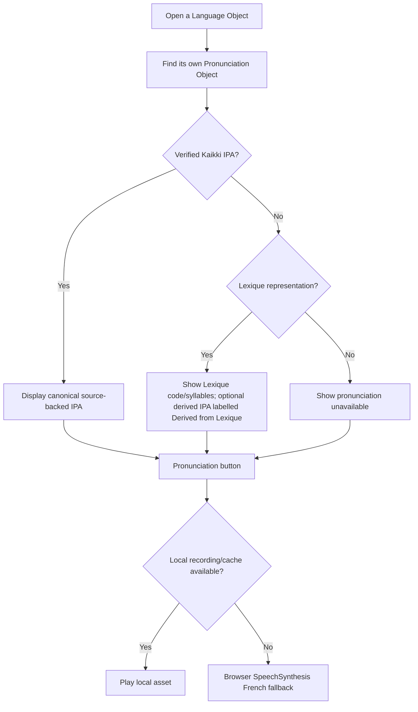

**Steps.** Each lemma, form, expression, or other speakable object finds its own stable Pronunciation Object. The UI prefers verified Kaikki IPA. Lexique phonological code and syllabification remain parallel source representations; a deterministic conversion can provide a visibly derived fallback, never pretend to be verified IPA. Playback is a separate provider chain: future/local audio first, browser TTS next. A form never inherits a lemma’s IPA merely to avoid an empty field.

**Why this shape.** The product exposed an important confusion: browser speech could pronounce a word while the page correctly said no verified IPA. Many apps erase that distinction, or copy the lemma pronunciation to every conjugated form. We rejected one opaque pronunciation string, source conversion without labels, cloud-only audio, and lemma fallback. Liens separates linguistic representation from how sound is delivered.

**USP.** Learners get immediate speech while understanding what Liens actually knows. **Implemented now:** Kaikki IPA/variants/audio metadata, Lexique representations and derived fallback, browser synthesis; remote audio playback is intentionally not enabled. **Next evolution:** verified local recordings and local TTS can join the same chain without changing page data or controls.

<div style="break-before: page; page-break-before: always;"></div>

### 8.4 AI Learning Flow

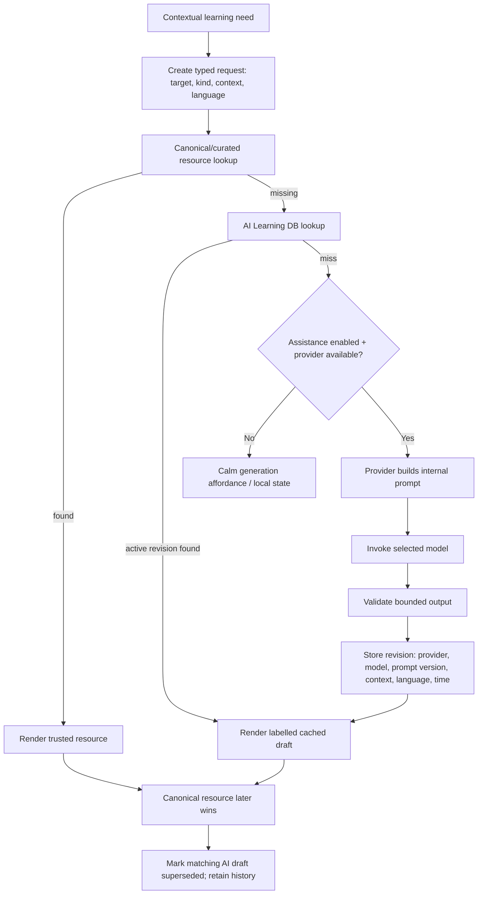

**Steps.** UI code asks for an intention—`explainSentence`, `generateUsageNote`, `generateExamples`, and so on—not a prompt. The request identity includes target, resource kind, sentence/sense context, language, and a contract version. The provider owns prompt construction. Gemini is the current development adapter, using environment-held credentials and its recorded prompt/model version. The answer is bounded, validated, labelled AI-generated, and stored as an immutable local revision. Later regeneration creates another revision; it never destroys the old one. A future source-backed or curated resource takes precedence and marks the draft superseded.

**Why this shape.** Generic `generate(prompt)` APIs leak prompt design throughout an app and make a provider swap expensive. Chat bubbles also tempt the learner to leave the object they were studying. We rejected AI as canonical truth, automatic bulk generation, Chinese-specific fields, and localStorage-only caching. Liens models AI output as multilingual Learning Resources, independent of the graph and of a particular provider.

**USP.** AI feels like native Liens content rather than a robot conversation, while the provenance is never hidden. **Implemented now:** Gemini adapter, prompt-version storage, IndexedDB cache/revisions, contextual actions, bounded unknown lookup, and multilingual resource identity. **Next evolution:** a provider registry, secure proxy, explicit generation-run metadata, evaluation, review queue, and user-controlled regeneration policies.

<div style="break-before: page; page-break-before: always;"></div>

### 8.5 Vocabulary and Personal Learning Flow

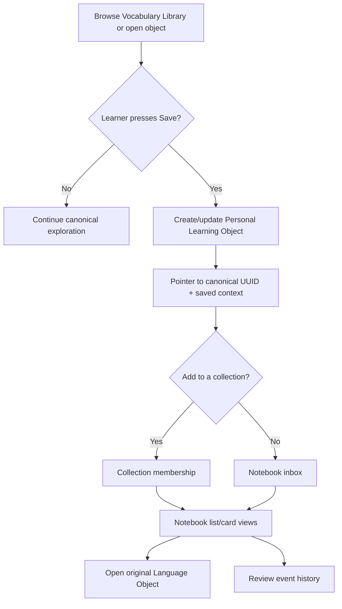

**Steps.** Vocabulary Library reads the canonical graph by CEFR, frequency, and part of speech; it never creates a second vocabulary store. Save creates a learner-owned record pointing to exactly what was saved: a word, a lexical sense, a form, an expression, grammar, or a sentence. Collections contain those typed personal records. Notebook views read these pointers, open the original graph page, and never copy dictionary content into a flashcard database.

**Why this shape.** During development, “Vocabulary Notebook” initially became a saved-items surface, while the real need for browsing all A1–C2 words remained unmet. Traditional apps commonly collapse global catalog, saved word, and flashcard into one object. We rejected a duplicate dictionary, a generic string bookmark, and a notebook that flattens sense/form/sentence distinctions. Liens separates the public language graph from the learner’s relationship with it.

**USP.** Discovery and ownership coexist: a learner can browse the shared language path, then preserve exactly the meaning or form that matters. **Implemented now:** CEFR Library, typed saves, collections, notebook list/card navigation, and review events in personal IndexedDB. **Next evolution:** sync can replicate personal records by canonical UUID without copying the canonical graph.

<div style="break-before: page; page-break-before: always;"></div>

### 8.6 Review Flow

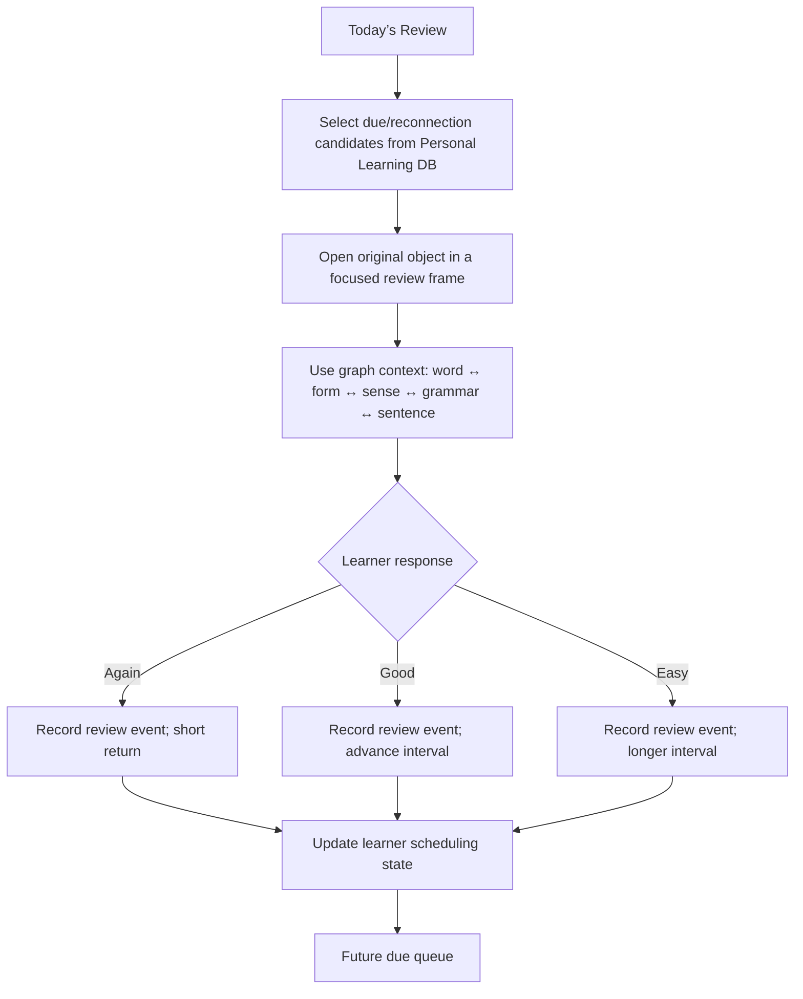

**Steps.** Review reads personal records and their event history, then opens the original object so the learner can reconnect it to its graph context. The intended scheduler records a response event (`Again`, `Good`, or `Easy`) and derives future due state from those events rather than mutating canonical data. Candidate selection can use relationships: a confusing form may surface with its lemma, a saved sense with a source-aligned example, or a grammar object beside the form that realizes it.

**Why this shape.** A flashcard algorithm alone is not Liens’ advantage; treating every card as isolated repeats the fragmentation that Liens was built to solve. We rejected copying content into static cards and claiming an SRS algorithm before its learner value was proven. **The choice.** Start with one calm daily reconnection and retain review events; add scheduling only when it can exploit graph context responsibly.

**USP.** Review can become understanding-oriented rather than recall-only. **Implemented now:** lightweight Today’s Review and retained review events, with no claimed spaced-repetition scheduler. **Next evolution:** the `Again / Good / Easy` event flow, due-state projection, and relationship-aware candidate policies are designed targets, not yet a shipped scheduling promise.

<div style="break-before: page; page-break-before: always;"></div>

### 8.7 Import and Release Flow

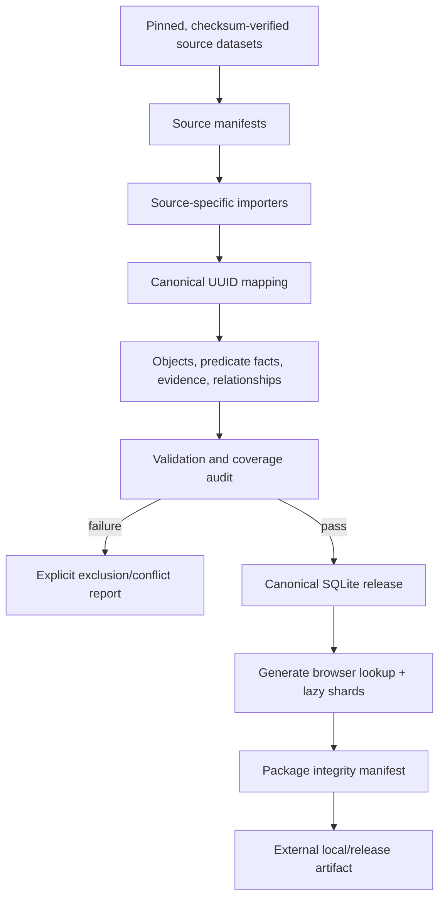

**Steps.** A source is pinned by manifest before an importer maps source records to existing or new canonical UUIDs. Importers add evidence-backed facts and edges; they do not reshape identity around a source. Validation checks foreign keys, orphaned facts/relationships, duplicates, evidence, coverage, and package integrity. Conflicting or unsupported rows become visible exclusions, not silent data. A successful build emits SQLite, browser package, reports, and checksums outside ordinary Git; Git stores the recipe—schemas, migrations, scripts, manifests, curated inputs, and docs.

**Why this shape.** The prototype’s tracked SQLite and browser packages grew to gigabytes, while hand-editable artifacts obscured reproducibility. Git LFS would store the same generated truth in a different place without solving source replacement or release discipline. We rejected browser JSON as canonical data, unpinned downloads, and AI-generated canonical gap filling.

**USP.** Liens can grow from A1 to future languages without sacrificing provenance or repository health. **Implemented now:** pinned-source build scripts, audits, external artifact strategy, and sharded static package. **Next evolution:** automated source acquisition, attribution/license checks, signed release publishing, and incremental client updates.

<div style="break-before: page; page-break-before: always;"></div>

### 8.8 Native Navigation Flow

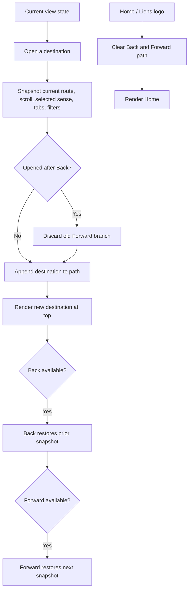

**Steps.** Before every destination change, Liens records view state: scroll position, selected sense/form, expanded panels, Vocabulary filters, sort, and page. A new destination after Back begins a new branch and clears only the old Forward path. Back and Forward traverse existing snapshots rather than creating new pages. Home and the logo deliberately erase the exploration path, beginning a new session. Controls appear only when an action exists.

**Why this shape.** Page-level Back buttons, browser-style infinite history, and reset-on-render behaviour made early graph exploration confusing and lost context. We rejected duplicate navigation controls and a Chrome/Safari mental model. Liens adopts the quieter pattern of Finder, Apple Music, and Settings.

**USP.** The learner can wander deeply through connected language while always feeling oriented. **Implemented now:** branch-based header navigation, state/scroll restoration, and Home reset. **Next evolution:** persisted cross-session exploration history may be considered only if it preserves this intentional, non-browser-like mental model.

---

## 9. AI: complete learning without fake certainty

The resolver order is:

1. Canonical source-backed graph and curated learning content.
2. Locally cached AI Learning Database resource.
3. Online AI generation, only when the learner enables assistance or a configured language fallback applies.

An AI result is labelled **AI-generated** or **AI learning draft**, carries provider, model, timestamp, prompt version, language, request context, and revision history. A superior curated/source-backed resource wins automatically; the AI draft remains history and is marked superseded.

The current development provider is Gemini. The browser asks for typed learning operations—not prompts—such as `explainSentence`, `generateUsageNote`, or `generateExamples`.

| Concern | Location |
| --- | --- |
| Provider interface | `gemini-provider.js` |
| Request/caching lifecycle | `ai-learning.js`, `ai-learning-store.js` |
| Development server, prompts, model selection | `dev_server.py` |
| Key/model configuration | `GEMINI_API_KEY` (or `GOOGLE_API_KEY`), optional `GEMINI_MODEL` |

Prompts remain inside the provider/server boundary. `PROMPT_VERSION` is persisted with every generated resource; the request contract version is retained in generation context. A dedicated `generation_version` can be added later as metadata without changing object identity or cache ownership.

To add OpenAI, Claude, OpenRouter, or a local model: implement the same typed provider methods, keep the UI and learning-resource schema unchanged, then add a provider registry/configuration layer when multiple adapters are actively needed.

---

## 10. How the graph is built and released

The repository tracks **source manifests, schemas, migrations, importers, audits, and build scripts**. SQLite and browser indexes are generated release outputs whenever practical—not hand-maintained truth.

| Source family | Main contribution |
| --- | --- |
| FLELex / Beacco | CEFR, lexical baseline, frequency. |
| Lexique 3.83 | Forms, morphology, phonological codes, syllables. |
| Morphalou 3.1 | Complementary verb morphology. |
| Kaikki / Wiktionary | Senses, translations, examples, expressions, relations, IPA/audio metadata. |
| Curated grammar | Pedagogically structured grammar concepts and links. |

Typical full release build:

```bash
python3 scripts/build_c1_c2_release.py
python3 scripts/audit_a1_b2_graph.py
python3 scripts/audit_pronunciation_graph.py
```

Every import is pinned by source release and records provenance. Validation checks foreign keys, orphaned objects/facts/relationships, duplicate identities, reproducibility, coverage, and graph traversal. Conflicts are represented as competing facts/evidence rather than silently discarded.

---

## 11. The learner’s surfaces

| Surface | Purpose | Design intent |
| --- | --- | --- |
| Home | Search, Vocabulary, Today’s Review, Settings. | Nothing unnecessary. |
| Word page | Lemma as anchor; senses expand in place; forms, grammar, pronunciation, examples connect outward. | One word, many meanings—not many unrelated pages. |
| Sentence page | Local breakdown, linked forms/objects, grammar matches, contextual explanations. | A sentence is an entry point, never a dead end. |
| Vocabulary Library | A1–C2 browsing, frequency-first by default, POS filters, pagination. | A learning path, not a raw index. |
| Notebook | Learner-saved objects and collections, list/card views, open-original action. | A calm reading notebook, not a flashcard clone. |
| Review | Lightweight “Today’s Review” based on saved objects and review events. | Relationship-aware review can deepen later. |
| Unknown lookup | Small provisional AI note, cached as a searchable recent lookup. | Useful now; never masquerades as verified graph data. |
| Settings | Chinese visibility, online learning assistance, local preferences. | Reference language is a resource language, never a Chinese-only subsystem. |

Navigation follows a focused native-app model: a single Back/Forward path preserves page state and scroll position; a new branch clears Forward; the Liens logo/Home resets exploration. Controls are only visible when available.

---

## 12. The next chapters

**Strong today:** local A1–C2 graph browsing, forms and conjugation, source/derived pronunciation representations, sentence gateway, AI learning drafts, Vocabulary Library, notebook/collections, and lightweight review.

**Next product work:** evaluate AI teaching quality in real use; deepen grammar/expression/example connections; make review graph-aware; improve offline release delivery; add a provider registry and a secure production proxy.

**Longer horizon:** curated editorial workflow for AI drafts, optional sync, native desktop/mobile packaging, additional learner reference languages, richer deterministic analysis, and collaborative curation.

The test for every future feature is simple: **does it strengthen the learner’s connected understanding of French without weakening provenance, calmness, or trust?**

---

## Appendix: where to look next

| Need | Start here |
| --- | --- |
| What exists today | [CURRENT_STATE.md](CURRENT_STATE.md) |
| Why a key choice was made | [DECISION_LOG.md](DECISION_LOG.md) |
| Immutable product identity | [LIENS_BIBLE.md](LIENS_BIBLE.md) |
| Frozen system boundaries | [ARCHITECTURE_FREEZE_V1.md](ARCHITECTURE_FREEZE_V1.md) |
| Source/import contract | [architecture/source_imports.md](architecture/source_imports.md) |
| AI Learning Layer contract | [architecture/ai_learning_assistance.md](architecture/ai_learning_assistance.md) |
| Personal Learning Layer contract | [architecture/personal_learning.md](architecture/personal_learning.md) |

This book is the concise orientation piece. The linked documents are the living contracts when a change needs precise implementation detail.
