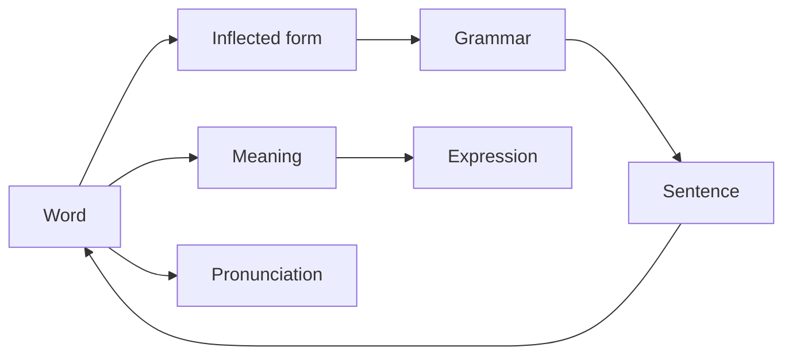
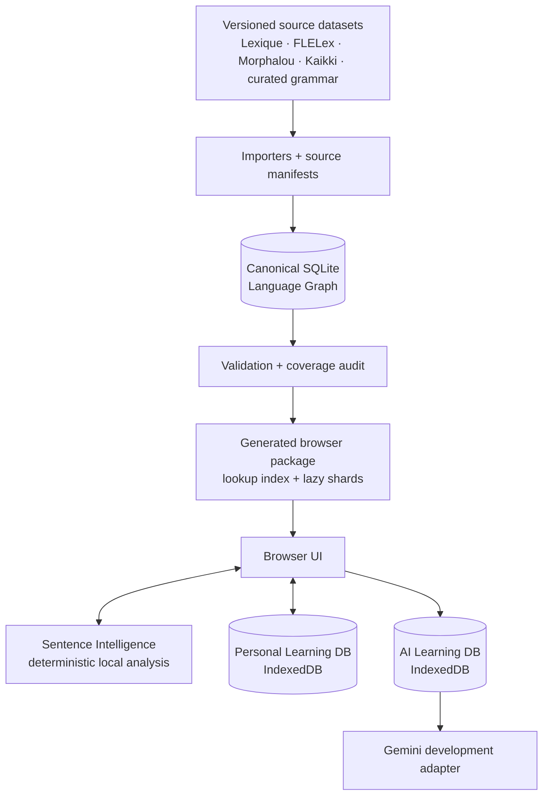
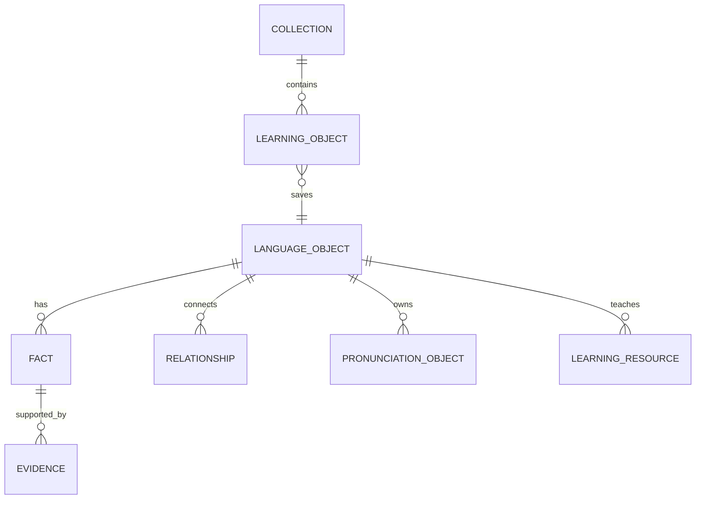
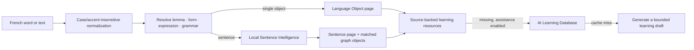

# Liens

## Product & Architecture Book

> **French, understood as a connected system.**
>
> Liens turns a lookup into a path: word → form → meaning → grammar → example → the next useful idea.

---

## 1. The idea in one page

French learning is usually fragmented: a dictionary for definitions, a conjugator for forms, a grammar site for rules, flashcards for review, and a chatbot for explanations. Liens brings those moments together without pretending that a chatbot is the product.

Liens is a **local-first language learning environment** built on a connected, evidence-backed Language Graph. It is not a dictionary, translator, course, or AI chat window. A learner starts anywhere—an unfamiliar word, an inflected form, or a sentence—and remains inside one calm, explorable system.



### The product promises

| Promise | What it means in practice |
| --- | --- |
| Teach, not merely define | Show meaning in context, patterns, forms, and useful next connections. |
| Trust structure | Canonical linguistic knowledge has source evidence and does not come from an LLM. |
| Never strand the learner | When teaching content is missing, clearly labelled AI learning drafts can help. |
| Preserve context | A word remains the visual anchor while its meanings expand in place. |
| Stay calm | Spacious pages, small purposeful actions, and no “database browser” feeling. |

---

## 2. What makes Liens different

### ⭐ A graph, not a pile of entries

Every meaningful unit is a Language Object: a word, sense, form, expression, grammar concept, sentence, conjugation pattern, or pronunciation. Their links create the learning path.

### ⭐ Facts are separate from sources

Liens does not say “a source owns a word.” A stable object owns an evidence-backed fact: *prendre* → `part_of_speech` → `verb`, supported by a specific source release. This keeps identities stable while sources can improve or disagree.

### ⭐ Grammar has its own place

Présent, futur proche, agreement, pronouns, negation, and constructions are navigable objects—not AI labels pasted onto a sentence.

### ⭐ AI completes teaching; it does not rewrite language

AI can make an empty learning slot useful: an explanation, a Chinese reference note, a memory tip, or a contextual sentence reading. It cannot create canonical objects, facts, or relationships.

### ⭐ Personal learning is separate from shared knowledge

Saves, collections, and review events belong to the learner. They never contaminate the shared graph and can evolve independently.

---

## 3. How Liens got here

| Chapter | Decision | Why it mattered |
| --- | --- | --- |
| Prototype | Search opened directly into learning pages. | Removed the “search results first” dead end. |
| Graph foundation | Words, forms, expressions, grammar, and sentences became objects. | Made infinite exploration possible. |
| Evidence model | Stable UUIDs, predicate facts, and evidence replaced source-shaped records. | Preserves identity across imports and future source changes. |
| Golden slice | A1–C2 became an imported graph, not a hand-built demo list. | Proved the production pipeline before further features. |
| Learning layer | AI drafts live in a separate local database. | Gives help without weakening trust. |
| Personal layer | Saves and collections became learner-owned records. | Supports review without turning Liens into Anki. |
| Native navigation | Back/Forward behaves like a focused app; Home starts fresh. | Keeps exploration understandable. |

Alternatives deliberately rejected: a flat dictionary schema, one enormous browser JSON file, AI-generated canonical facts, and a chatbot as the primary interface.

---

## Design Rationale — the stories behind the system

These are not implementation rules. They record the learner problems that made Liens choose its shape.

### The Language Graph

**Problem discovered.** Looking up *sommes* used to lead to an isolated definition or a failed search, while the learner needed *être*, its present-tense form, and examples. **Why the usual answer fails.** Dictionaries keep forms, meanings, grammar, and examples in separate reference views; flashcard apps flatten them into disconnected cards. **Alternatives rejected.** A larger word table and hard-coded cross-links would have looked complete but broken as coverage grew. **Liens’ choice.** Every meaningful element is a typed, connected object. **USP.** Exploration continues naturally from a form to its lemma, grammar, expression, or sentence. **Future enabled.** Relationship-aware review, richer sentence analysis, and new object types can arrive without changing the learning metaphor.

### Evidence-backed canonical knowledge

**Problem discovered.** Linguistic sources overlap, disagree, and evolve; tying an object’s identity to one importer made saved learning fragile. **Why the usual answer fails.** Many learning products hide their sources or overwrite an old value with a new one, leaving no way to understand a conflict. **Alternatives rejected.** Source-specific IDs and a single “best” text field. **Liens’ choice.** Stable UUID object → predicate fact → evidence. **USP.** Liens can say what it knows, why it believes it, and still preserve a learner’s saved link across imports. **Future enabled.** Conflict resolution, editorial review, commercial datasets, and public APIs without data migration trauma.

### Local-first browser graph

**Problem discovered.** A learning lookup should feel immediate, including on weak or absent connectivity; loading a giant export made the prototype slow and brittle. **Why the usual answer fails.** Cloud dictionaries make every tap a request, while monolithic offline bundles punish first load. **Alternatives rejected.** A browser reading SQLite directly or one giant JSON dictionary. **Liens’ choice.** A generated static lookup index with integrity-checked lazy detail shards. **USP.** Fast local resolution with a package that can grow beyond a demo. **Future enabled.** Desktop/mobile packaging, offline releases, incremental package updates, and large multilingual graphs.

### Sentence Intelligence as a gateway

**Problem discovered.** Learners paste real French, not neat dictionary headwords, but a sentence page that only tokenizes text feels empty and untrustworthy. **Why the usual answer fails.** Parser-first products show technical trees, while chatbots produce fluent explanations that may invent the underlying analysis. **Alternatives rejected.** Exact-sentence lookup and letting an LLM decide every grammatical truth. **Liens’ choice.** Deterministic local resolution of forms, contractions, expressions, and supported grammar objects first; AI explains only after matching. **USP.** A sentence opens the graph rather than becoming a one-off answer. **Future enabled.** Increasingly capable parsing with stable grammar pages and auditable confidence.

### AI Learning Layer, not AI knowledge

**Problem discovered.** Local coverage will never make every page feel fully taught, yet silently filling gaps with AI destroys trust. **Why the usual answer fails.** Chatbots forget context and repeat token costs; AI-first dictionaries blur generated prose with source-backed facts. **Alternatives rejected.** No AI at all, or AI writes directly into the graph. **Liens’ choice.** Typed, language-aware learning resources in a separate IndexedDB with provenance, prompt version, revision, and replacement rules. **USP.** Liens can be helpful now and more trustworthy later: curated content automatically outranks a cached draft. **Future enabled.** Provider switching, quality experiments, human review, multilingual teaching, and safe regeneration.

### Pronunciation as representations

**Problem discovered.** “No IPA” was confusing when browser TTS could still speak a word; treating every notation as IPA would create false certainty. **Why the usual answer fails.** Most apps show one opaque phonetic string or equate playback with verified pronunciation. **Alternatives rejected.** Copying a lemma’s sound to each form, converting source codes invisibly, or storing only audio. **Liens’ choice.** A Pronunciation Object holds parallel Kaikki IPA, Lexique codes/syllables, derived representations, and audio metadata, each labelled by provenance. **USP.** Learners receive useful playback without mistaking it for canonical evidence. **Future enabled.** Cached recordings, local TTS, regional variants, and corrected sources without redesign.

### Personal learning, library, and review

**Problem discovered.** “Vocabulary” meant two different needs: browse the whole language and revisit what *I* chose. **Why the usual answer fails.** Traditional apps mix a global dictionary with saved cards, then force every object into the same flashcard scheduling model. **Alternatives rejected.** One generic saved-item list or a separate duplicate dictionary UI. **Liens’ choice.** The Vocabulary Library browses canonical CEFR objects; the Notebook stores typed personal pointers, collections, and lightweight review events. **USP.** Learners can discover broadly while retaining a meaningful personal trail. **Future enabled.** Graph-based review prompts—word ↔ form ↔ sentence ↔ grammar—rather than isolated cards.

### Calm, native exploration

**Problem discovered.** Deep graph navigation easily turned into stacks of giant titles, duplicate back buttons, and lost scroll positions. **Why the usual answer fails.** Browser-like history exposes mechanics; tab-heavy dictionary screens make a word feel like a dashboard. **Alternatives rejected.** A separate page for every lexical sense and infinite browser history. **Liens’ choice.** The lemma stays anchored, senses expand in place, and one Apple-like Back/Forward path preserves state; Home starts a new session. **USP.** The graph feels like one continuous language, not a database of destinations. **Future enabled.** Deeper relationship journeys without cognitive overload on mobile or desktop.

---

## 4. The system at a glance



| Layer | Owns | Never does |
| --- | --- | --- |
| Browser UI | Reading, exploration, settings, navigation. | Treat generated UI state as linguistic truth. |
| Canonical Graph | Object identity, facts, evidence, typed relationships. | Accept hidden AI writes. |
| Build pipeline | Imports, validation, repeatable release generation. | Hand-edit generated artifacts. |
| Browser package | Fast, static, lazy local lookup. | Replace canonical SQLite. |
| AI Learning DB | Cached drafts, revisions, provenance, recent unknown lookups. | Become canonical knowledge. |
| Personal Learning DB | Saves, collections, review events. | Change shared data. |

---

## 5. The language model



| Object | Learner meaning | Important rule |
| --- | --- | --- |
| Language Object | The durable identity of *aller*, *vais*, futur proche, or an expression. | UUIDs are source-independent and permanent. |
| Fact + Evidence | A claim and its attributable support. | Facts use predicates; evidence is not attached vaguely to the object. |
| Relationship | A typed edge such as `inflected_form_of`, `expresses`, or `governs_preposition`. | It is evidence-backed canonical graph knowledge. |
| Lexical Sense | One learnable meaning under a word. | It expands under the lemma rather than becoming a heavy new destination. |
| Pronunciation Object | Several parallel representations: Kaikki IPA, Lexique phonological code, syllables, audio metadata. | Derived Lexique IPA is explicitly derived; browser TTS is playback only. |
| Learning Resource | Explanation, example, Chinese reference note, tip, or comparison. | It has language, provenance, revision, and lifecycle. |
| Learning Object | A learner’s saved pointer to an object/sense/sentence/grammar item. | Personal, never shared graph data. |

---

## 6. When a learner searches



The original query is preserved for display. The canonical spelling is preserved for the object: `etre` resolves to **être**, not to a duplicate entry. An inflected form such as **sommes** opens its own object and states that it is an inflected form of **être**.

Sentence Intelligence is intentionally modest and deterministic. It identifies high-confidence forms, contractions, expressions, and supported grammar objects first. AI can explain those matches; it does not quietly invent them.

---

## 7. AI: complete learning without fake certainty

The resolver order is:

1. Canonical source-backed graph and curated learning content.
2. Locally cached AI Learning Database resource.
3. Online AI generation, only when the learner enables assistance or a configured language fallback applies.

An AI result is labelled **AI-generated** or **AI learning draft**, carries provider, model, timestamp, prompt version, language, request context, and revision history. A superior curated/source-backed resource wins automatically; the AI draft remains history and is marked superseded.

The current development provider is Gemini. The browser asks for typed learning operations—not prompts—such as `explainSentence`, `generateUsageNote`, or `generateExamples`.

| Concern | Location |
| --- | --- |
| Provider interface | `gemini-provider.js` |
| Request/caching lifecycle | `ai-learning.js`, `ai-learning-store.js` |
| Development server, prompts, model selection | `dev_server.py` |
| Key/model configuration | `GEMINI_API_KEY` (or `GOOGLE_API_KEY`), optional `GEMINI_MODEL` |

Prompts remain inside the provider/server boundary. `PROMPT_VERSION` is persisted with every generated resource; the request contract version is retained in generation context. A dedicated `generation_version` can be added later as metadata without changing object identity or cache ownership.

To add OpenAI, Claude, OpenRouter, or a local model: implement the same typed provider methods, keep the UI and learning-resource schema unchanged, then add a provider registry/configuration layer when multiple adapters are actively needed.

---

## 8. How the graph is built and released

The repository tracks **source manifests, schemas, migrations, importers, audits, and build scripts**. SQLite and browser indexes are generated release outputs whenever practical—not hand-maintained truth.

| Source family | Main contribution |
| --- | --- |
| FLELex / Beacco | CEFR, lexical baseline, frequency. |
| Lexique 3.83 | Forms, morphology, phonological codes, syllables. |
| Morphalou 3.1 | Complementary verb morphology. |
| Kaikki / Wiktionary | Senses, translations, examples, expressions, relations, IPA/audio metadata. |
| Curated grammar | Pedagogically structured grammar concepts and links. |

Typical full release build:

```bash
python3 scripts/build_c1_c2_release.py
python3 scripts/audit_a1_b2_graph.py
python3 scripts/audit_pronunciation_graph.py
```

Every import is pinned by source release and records provenance. Validation checks foreign keys, orphaned objects/facts/relationships, duplicate identities, reproducibility, coverage, and graph traversal. Conflicts are represented as competing facts/evidence rather than silently discarded.

---

## 9. The learner’s surfaces

| Surface | Purpose | Design intent |
| --- | --- | --- |
| Home | Search, Vocabulary, Today’s Review, Settings. | Nothing unnecessary. |
| Word page | Lemma as anchor; senses expand in place; forms, grammar, pronunciation, examples connect outward. | One word, many meanings—not many unrelated pages. |
| Sentence page | Local breakdown, linked forms/objects, grammar matches, contextual explanations. | A sentence is an entry point, never a dead end. |
| Vocabulary Library | A1–C2 browsing, frequency-first by default, POS filters, pagination. | A learning path, not a raw index. |
| Notebook | Learner-saved objects and collections, list/card views, open-original action. | A calm reading notebook, not a flashcard clone. |
| Review | Lightweight “Today’s Review” based on saved objects and review events. | Relationship-aware review can deepen later. |
| Unknown lookup | Small provisional AI note, cached as a searchable recent lookup. | Useful now; never masquerades as verified graph data. |
| Settings | Chinese visibility, online learning assistance, local preferences. | Reference language is a resource language, never a Chinese-only subsystem. |

Navigation follows a focused native-app model: a single Back/Forward path preserves page state and scroll position; a new branch clears Forward; the Liens logo/Home resets exploration. Controls are only visible when available.

---

## 10. The next chapters

**Strong today:** local A1–C2 graph browsing, forms and conjugation, source/derived pronunciation representations, sentence gateway, AI learning drafts, Vocabulary Library, notebook/collections, and lightweight review.

**Next product work:** evaluate AI teaching quality in real use; deepen grammar/expression/example connections; make review graph-aware; improve offline release delivery; add a provider registry and a secure production proxy.

**Longer horizon:** curated editorial workflow for AI drafts, optional sync, native desktop/mobile packaging, additional learner reference languages, richer deterministic analysis, and collaborative curation.

The test for every future feature is simple: **does it strengthen the learner’s connected understanding of French without weakening provenance, calmness, or trust?**

---

## Appendix: where to look next

| Need | Start here |
| --- | --- |
| What exists today | [CURRENT_STATE.md](CURRENT_STATE.md) |
| Why a key choice was made | [DECISION_LOG.md](DECISION_LOG.md) |
| Immutable product identity | [LIENS_BIBLE.md](LIENS_BIBLE.md) |
| Frozen system boundaries | [ARCHITECTURE_FREEZE_V1.md](ARCHITECTURE_FREEZE_V1.md) |
| Source/import contract | [architecture/source_imports.md](architecture/source_imports.md) |
| AI Learning Layer contract | [architecture/ai_learning_assistance.md](architecture/ai_learning_assistance.md) |
| Personal Learning Layer contract | [architecture/personal_learning.md](architecture/personal_learning.md) |

This book is the concise orientation piece. The linked documents are the living contracts when a change needs precise implementation detail.
