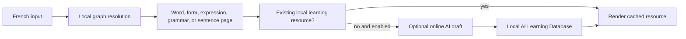

# 1. Product and Experience

## Why Liens exists

French learners routinely fragment their work across a dictionary, grammar site, conjugator, translation tool, pronunciation tool, example database, flashcard system, and AI chat. Each tool answers a narrow question but breaks the learner's context. Liens exists to make the language itself the navigable environment.

The product is built around the idea that every meaningful element of French can be a **Language Object**: a word, an inflected form, a lexical sense, an expression, a grammar construction, a pronunciation, a sentence, or a future learning object such as an exercise. Objects are connected by typed relationships, so an answer becomes a useful next question rather than a dead end.

Liens is deliberately **not**:

- a dictionary whose endpoint is a gloss;
- a translator whose endpoint is a result;
- a fixed course that prescribes one route for every learner;
- an Anki replacement that treats all learning material as detached cards;
- a chatbot whose conversation is the product;
- a raw graph browser or database administration surface.

The product loop is **Learn → Explore → Save → Review**. The graph makes exploration meaningful; the Personal Learning Layer lets a learner return to selected objects; review reconnects those objects to their relationships instead of reducing them to isolated prompts.

## Product philosophy

| Principle | Product consequence |
| --- | --- |
| Teach, do not merely define | Pages explain use, pattern, contrast, and next connections where information exists. |
| Context creates meaning | A word page privileges senses, forms, examples, grammar, and related objects over a single flat translation. |
| Exploration is learning | Every clickable object should open a real language object or a useful local analysis. |
| Reduce friction, not thought | One search field accepts words, forms, expressions, and sentences; the learner never first selects a tool. |
| Preserve anchors | A sense expands within its word page; sentence analysis remains anchored to the submitted sentence. |
| Calm beats density | Progressive disclosure hides depth until it is useful; the interface does not try to show the whole graph at once. |
| Trust is visible | Source-backed graph content and AI-generated learning drafts are distinguishable. |

English is always a bridge language. Chinese is an optional reference language controlled in Settings. Both help comprehension but do not replace engagement with French.

## Language graph versus AI assistant

The **Language Graph** is the shared, canonical model of French. It owns object identity, facts, evidence, relationships, morphology, grammar topology, source-backed senses, and pronunciation representations. It is strict because learners must be able to trust its structure.

The **Learning Layer** makes that structure useful to a person. It can contain source-backed teaching material, human notes, teacher annotations, and clearly labelled AI drafts. It strives for completeness without pretending every explanation is canonical truth.

AI therefore explains, summarizes, translates, creates a bounded provisional note for unknown input, and supplies optional examples or memory aids. AI must never silently create or overwrite canonical objects, facts, relationships, grammar rules, or CEFR classifications. A future review process may promote a draft only through an explicit, source-aware import or editorial workflow.

## Local-first product behavior

Local-first means the learner receives the deterministic graph result before a network call:

The app still works as a learning graph if the AI provider is unavailable. Browser SpeechSynthesis is likewise only a playback fallback; it does not create pronunciation knowledge.

## Navigation philosophy

Liens follows native Apple application navigation (Finder, Apple Music, Settings), not Chrome or Safari history.

- There is one navigation system: persistent header Back and Forward controls.
- Back or Forward is shown only when that exact adjacent destination exists.
- The history is a bounded in-session branch: Back then opening a new destination immediately discards the stale Forward branch.
- Back and Forward restore the learner's scroll position and relevant view state, including Vocabulary level/category/sort/page, expanded sense panels, and selected conjugation state.
- The Liens logo and Home control reset both stacks and begin a new exploration session.
- Page-level “Back” buttons are intentionally absent; duplicated navigation makes learners reason about history instead of language.

## UI and interaction philosophy

The interface should feel calm, premium, spacious, and continuous. Typography and empty space keep a long learning session comfortable. Motion exists only to explain continuity, focus, or state. The product avoids dashboard density, visible database labels, chat bubbles, gamified collection pressure, and giant grammar-table interfaces.

Key interaction decisions:

- Search resolves directly; there is no intermediate search-results page.
- Sense exploration is in place. The French lemma remains the largest visual anchor, with compact meaning panels below it.
- Conjugation follows learning groups and pedagogical subject order rather than raw source ordering.
- Vocabulary Library is a discovery surface over all canonical words; Notebook is a personal surface over saved learner objects. They are not two views of the same data.
- Long-lived pages use the same object page rather than making copied mini-dictionaries or duplicate flashcard content.

## Long-term vision

Liens can grow into a richer French graph, relationship-aware review, reading and listening experiences, editorial curation, carefully bounded AI tutoring, and eventually other languages. Those are expansions, not reinventions: every addition must preserve connected understanding, provenance, calm interaction, and a clear distinction between shared language knowledge and a learner's private learning history.

For the enduring constitution, see [LIENS_BIBLE.md](../LIENS_BIBLE.md). For active experience requirements, see [PRODUCT_BIBLE.md](../PRODUCT_BIBLE.md).
