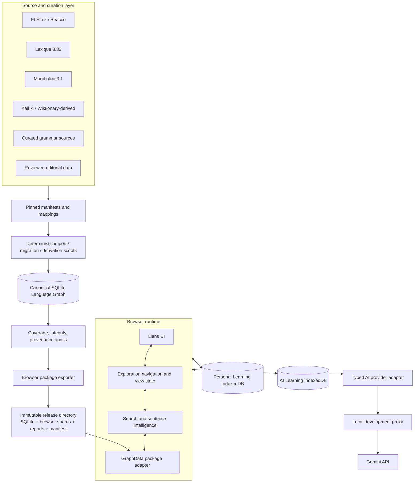

# 2. System Architecture

## System at a glance

Liens is a static browser application backed by a generated local graph package. The canonical graph is built in SQLite from pinned source datasets and deterministic import scripts. Personal state and AI learning drafts are deliberately separate browser IndexedDB databases.



## Layer contracts

### 1. Browser UI

**Purpose:** Present a learner-first exploration experience.
**Ownership:** `index.html`, `styles.css`, `app.js`.
**Responsibilities:** Render home, object, sentence, Vocabulary Library, Notebook, review, and settings surfaces; make canonical objects navigable; label AI drafts; maintain accessible controls and visual continuity.
**Dependencies:** Browser runtime state, `GraphData`, Sentence Intelligence, Personal Learning Layer, Learning Assistance APIs.
**Must not:** Query SQLite directly, expose raw tables, generate canonical graph content, or contain provider prompts.

`app.js` is presently a compact direct-DOM application. It owns rendering and interaction state, but future UI growth should introduce clear view-model and rendering modules before a new feature makes this file unmaintainable. This is an explicit Architecture Freeze risk, not permission to bypass the existing contracts.

### 2. Browser runtime and navigation

**Purpose:** Convert learner intent into a local route and preserve exploration context.
**Ownership:** `app.js`.
**Responsibilities:** Normalize input; choose object versus sentence route; load objects lazily; preserve scroll/view state; manage branch-based Back/Forward stacks; reset on Home.
**Dependencies:** `graph-data.js`, `sentence-intelligence.js`, object relationships in the package.
**Must not:** Persist global shared graph state, use browser-history semantics, or mutate the package.

Navigation state is session-local only. A history entry is `{ target, scrollY }`; `target` carries page-specific state such as Vocabulary category/sort/page or selected sense. A brand-new `go(next)` pushes the current entry and clears Forward. `goBack` and `goForward` traverse existing entries rather than creating destinations.

### 3. Local graph access adapter

**Purpose:** Hide the generated package format from page code.
**Ownership:** `graph-data.js`.
**Responsibilities:** Locate the configured release, fetch `manifest.json` and `lookup.json`, hydrate detail shards only when an object is opened, validate package integrity, and expose objects to the UI.
**Dependencies:** Static HTTP serving and the package manifest.
**Must not:** Become a source of truth or invent data when an object is not found.

The default resolution roots are `releases/liens-c1-c2/browser` and then `data/wordbank/browser`. A `?graphRoot=...` query parameter selects a package explicitly. The application must be served over HTTP; `file://` blocks normal fetch behavior in many browsers.

### 4. Canonical Language Graph

**Purpose:** Store shared, evidence-backed language knowledge.
**Ownership:** Generated SQLite release; scripts under `scripts/`; source manifests under `data/wordbank/import-manifests/`.
**Responsibilities:** Stable object identity, predicates/facts/evidence, relationships, morphology, grammar, senses, pronunciation representations, source mappings, import runs, and source exclusions.
**Dependencies:** Pinned source artifacts and importer contracts.
**Must not:** Store learner saves, opaque UI state, provider secrets, or unreviewed AI content as truth.

### 5. Browser graph package

**Purpose:** Make the canonical graph usable in a static browser without downloading all object detail eagerly.
**Ownership:** `scripts/export_wordbank_index.py`, `scripts/test_browser_graph_package.py`, `graph-data.js`.
**Structure:** `manifest.json`, small `lookup.json`, and integrity-hashed lazy detail shards under `objects/`.
**Why it exists:** SQLite is the durable build representation; browser JSON is a versioned transport adapter optimized for local lookup and lazy page hydration.
**Must not:** Be hand-edited or treated as canonical.

### 6. Personal Learning Layer

**Purpose:** Store what one learner saved, organized, and reviewed.
**Ownership:** `personal-learning-store.js`; [personal-learning contract](../architecture/personal_learning.md).
**Responsibilities:** Typed saves, collections, collection memberships, append-only review events, one-time legacy save migration.
**Dependencies:** Stable target keys and canonical IDs when a target exists.
**Must not:** Copy canonical content, edit facts, or become an alternative dictionary.

### 7. AI Learning Layer

**Purpose:** Fill missing learner-oriented resource slots without contaminating the graph.
**Ownership:** `ai-learning-store.js`, `ai-learning.js`, provider adapter files.
**Responsibilities:** Local draft/revision cache, request identity, language-specific resources, provisional unknown lookup notes, provider invocation, provenance, lifecycle, prebuilt draft packs.
**Dependencies:** Typed learning-resource request and optional provider availability.
**Must not:** Write SQLite, create language objects, or present drafts as verified knowledge.

### 8. Sentence Intelligence

**Purpose:** Turn arbitrary French input into a deterministic gateway to graph objects.
**Ownership:** `sentence-intelligence.js`; [sentence contract](../architecture/sentence_intelligence.md).
**Responsibilities:** Tokenize; resolve forms/lemmas; handle selected contractions/elisions; identify modeled expressions; match only fully satisfied grammar patterns; surface unknown tokens and review candidates.
**Dependencies:** Hydrated local graph objects and typed relationships/features.
**Must not:** Claim complete parsing, name unsupported grammar, or create canonical language knowledge.

### 9. Source/import and release pipeline

**Purpose:** Reconstruct the graph deterministically from pinned inputs.
**Ownership:** import scripts, manifests, source catalogs/releases/records in SQLite, external release directories.
**Responsibilities:** Verify checksums, map source records, import facts/relationships/representations, record evidence and exclusions, run audits, export browser assets, emit release manifests.
**Must not:** Depend on a mutable upstream URL at release time or silently drop a source record.

## End-to-end runtime data flow

```mermaid
sequenceDiagram
  participant L as Learner
  participant UI as Browser UI
  participant R as Resolver
  participant P as Graph package
  participant S as Sentence Intelligence
  participant A as AI Learning DB / Provider

  L->>UI: enter French text
  UI->>R: preserve input + normalize lookup key
  R->>P: resolve exact local object/expression
  alt local object or form
    P-->>UI: Language Object + linked data
    UI->>A: request existing teaching resource
    A-->>UI: canonical/source resource or cached AI draft
  else multi-token sentence
    R->>S: deterministic graph analysis
    S-->>UI: tokens, forms, grammar, expressions, unknowns
    UI->>A: optional sentence guidance request
  else unknown single token
    UI->>A: bounded provisional note only when allowed
  end
  UI-->>L: local structure first; learning guidance second
```

## Architecture principles behind the split

The split between graph, browser package, personal state, and AI state is intentional:

- **Reproducibility:** A release can be rebuilt from manifests, sources, and deterministic rules.
- **Trust:** A provider outage or AI hallucination cannot alter French facts or graph topology.
- **Scalability:** Browser shards support many more objects without turning the app into a multi-gigabyte first load.
- **Future sync:** User data can synchronize by stable IDs without replicating the graph.
- **Future clients:** A native application, API, or server can consume the same graph contract while using a different transport format.

Read [Architecture Freeze v1.0](../ARCHITECTURE_FREEZE_V1.md) before altering any boundary in this chapter.
