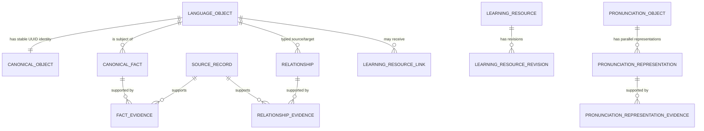

# 3. Data Model and Storage

## Canonical entity hierarchy

Liens separates identity, assertions, evidence, relationships, and learning content. This is the core decision that lets multiple sources disagree without destroying a learner's links or saved items.



## Identity: Language Object and Canonical Object

### `language_objects`

This is the graph node table. It stores an implementation-friendly object ID, type code, canonical/display form, normalized form, content status, and provenance boundary. It is the common endpoint for graph relationships and browser pages.

### `canonical_objects`

This table gives a Language Object a permanent, source-independent canonical UUID plus an `identity_key`. Canonical identifiers are UUIDv5-style deterministic identities generated from a Liens namespace and a source-neutral identity key, not database auto-increment values and not source record IDs.

Why this exists:

- a saved word, public link, future API reference, or synced review event survives re-import;
- FLELex, Kaikki, Lexique, Morphalou, and future commercial sources can map to the same object;
- migration can change storage internals without breaking product identity.

Use `scripts/canonical_identity.py` for identity policy. Importers must resolve an existing canonical identity or create it through the approved baseline workflow; they must never invent a source-shaped fallback object merely to improve coverage.

## Object types and their purpose

| Object type | What it represents | Important links | Product reason |
| --- | --- | --- | --- |
| `word` | Canonical lemma/POS lexical unit | `has_sense`, forms, pronunciation, grammar, examples | Main lexical anchor. |
| `lexical_sense` | One distinct meaning of a word | owner word, gloss facts, examples, sense relations | Avoids flattening a polysemous word into one translation. |
| `inflected_form` | A specific surface/form analysis | `inflected_form_of`, paradigm membership, own pronunciation | A form such as *sommes* is its own learnable object, never just an alias. |
| `expression`, `collocation`, `idiom` | Multi-word reusable unit | ordered components and `contains` edges | Lets a phrase be explored as more than separate tokens. |
| `grammar_construction` and grammar objects | Canonical grammar concept, construction, pattern, topic | prerequisites, contrasts, triggers, realization links | Grammar has pages and relationships rather than AI-only prose. |
| `sentence` | Independent source-backed or curated sentence | alignment, `illustrates`, target objects | Examples strengthen graph navigation instead of becoming strings embedded in entries. |
| conjugation objects | paradigm, learning group, tense, realization | form membership and teaching links | UI can present a pedagogical progression without hard-coded tables. |
| `pronunciation` | Stable owner-specific pronunciation container | `has_pronunciation`, parallel representations | Separates pronunciation knowledge from UI and audio delivery. |
| `learning_resource` | Non-canonical teaching material | revisions and target links | Allows explanations to evolve without altering facts. |

The allowed types and typed relationships are seeded in `object_types` and `relationship_types`. Adding a meaningful type is a schema/data migration decision, not a page-only convention.

## Facts, predicates, and evidence

A canonical assertion is not an anonymous field. It is:

```text
Language Object → predicate → typed value → Evidence
```

Examples:

```text
prendre → part_of_speech → verb → FLELex row
prendre → CEFR → A1 → FLELex row
prendre → IPA → /pʁɑ̃dʁ/ → Kaikki source record
```

Important tables:

| Table | Role |
| --- | --- |
| `fact_predicates` | Allowed predicate vocabulary. |
| `canonical_facts` | Fact lifecycle and subject/predicate identity. |
| `fact_text_values`, `fact_number_values`, `fact_code_values`, `fact_object_values` | Typed values; choose a table instead of serializing a data blob. |
| `fact_evidence` | Many-to-many link from fact to immutable source record. |
| `sources`, `source_catalogs`, `source_releases`, `source_records` | Source lineage from catalog through exact imported record. |

Multiple facts can coexist where sources differ. Do not “solve” a disagreement by overwriting a fact without a documented editorial decision. Evidence is attached to the fact, not merely to the object, because CEFR, IPA, morphology, and glosses can have different sources and confidence.

## Relationships and graph navigation

`relationships` stores directed typed edges. `relationship_types` defines their semantic code; `relationship_evidence` records what supports an imported edge.

Common examples:

```text
sommes ──inflected_form_of──> être
avoir besoin de ──contains──> avoir
venir ──belongs_to_conjugation──> venir paradigm
form ──member_of_paradigm──> tense paradigm
sentence ──illustrates──> lexical sense
word/form ──has_pronunciation──> stable pronunciation object
```

Relationships are graph knowledge, not a rendering shortcut. A UI must derive navigation from them; it must not hard-code a special list of verbs, grammatical triggers, or conjugation cells.

## Morphology and conjugation

Key tables include `forms`, `form_features`, `lexemes`, `verb_metadata`, `conjugation_realizations`, `conjugation_realization_components`, and `conjugation_tense_metadata`.

- Simple source-attested forms are first-class `inflected_form` objects with structured mood, tense, person, number, and gender where applicable.
- `inflected_form_of` links a form to its lemma and is directly evidenced.
- `member_of_paradigm` can be a transparent deterministic projection from an evidenced form into Liens' learning taxonomy; the derivation records its evidence role rather than claiming the source named the pedagogical group.
- Compound/periphrastic forms use `conjugation_realization` and ordered components instead of a text blob.
- French verb group is a predicate fact with a documented derivation policy, not a browser string guessed from spelling.

The browser displays canonical pedagogical order: `je`, `tu`, `il / elle / on`, `nous`, `vous`, `ils / elles`. Source order is never a UI order.

## Lexical senses, expressions, and sentences

### Senses

`lexical_senses` attaches independently navigable sense objects to an owner canonical object. Senses retain ordered source-backed English gloss facts, optional French definitions, evidence, and example links. The UI keeps the word as the visual anchor and expands senses in place.

### Multi-word objects

`multiword_components` retains ordered components; `multiword_component_evidence` preserves source surfaces. `contains` relationships provide traversal. The importer must not call a source phrase a collocation or idiom unless the source or a reviewed curation policy actually establishes that type.

### Sentences

Sentence records are independent Language Objects. `sentence_source_alignments` preserve the connection to the illustrated target. Sentence Intelligence creates per-input analysis records in `sentence_analysis_instances`, `sentence_analysis_nodes`, `sentence_analysis_edges`, and `sentence_analysis_object_matches`; these analyses are non-canonical and must never be promoted automatically.

## Pronunciation model

Each owner Language Object has one stable, source-independent `pronunciation` object. The object owns parallel evidence-backed representations in `pronunciation_representations`:

| Representation | Lifecycle | Source / meaning |
| --- | --- | --- |
| `phonological_code:lexique383` | Canonical source representation | Lexique phonological code; not IPA. |
| `syllabification:lexique383` | Canonical source representation | Lexique syllable data. |
| `ipa:ipa` | Canonical where Kaikki-backed | Verified Kaikki IPA, with region/dialect/note metadata. |
| `audio_url:wikimedia_commons` | Canonical metadata | Kaikki audio URL metadata only; no playback contract. |
| `ipa:lexique383_derived_ipa_v1` | `derived` or `superseded` | Deterministic fallback, visibly labelled **Derived from Lexique**. |

`pronunciation_representation_evidence` preserves exact source support. `pronunciation_object_details` is a browser projection of the preferred displayable representation; it is not a competing truth table. A form uses only its own pronunciation object and never silently inherits lemma pronunciation.

Read [pronunciation.md](../architecture/pronunciation.md) before changing this subsystem.

## Storage systems and mutation rules

### Canonical SQLite graph

**Location:** external release artifact, typically `releases/liens-c1-c2/liens-knowledge.sqlite` through the repository symlink.
**Written by:** migrations, importers, projections, and release builds.
**Read by:** exporter and audits; never directly by the browser.
**Never do:** hand-edit production rows, write AI output into it, store per-user data, or commit multi-gigabyte generated releases as ordinary Git source.

### Browser graph package

**Location:** release `browser/` directory.
**Contents:** `manifest.json`, `lookup.json`, lazy `objects/` shards.
**Written by:** `scripts/export_wordbank_index.py`.
**Read by:** `graph-data.js`.
**Never do:** edit package JSON by hand; rebuild it after any graph projection change.

### AI Learning Database (IndexedDB)

**Database:** `liens-ai-learning`.
**Stores:** `learning_resources`, `recent_lookups`.
**Written by:** `ai-learning-store.js` through `ai-learning.js`.
**Lifecycle:** active AI drafts/revisions are cached locally; canonical/source-backed content takes display precedence; matching AI drafts are marked `superseded`, not deleted.
**Never do:** export it as graph content, treat it as shared truth, or let it mutate SQLite.

### Personal Learning Database (IndexedDB)

**Database:** `liens-personal-learning`.
**Stores:** `learning_objects`, `collections`, `collection_memberships`, `review_events`.
**Written by:** `personal-learning-store.js`.
**Never do:** copy word pages into cards or change canonical facts. Use stable target keys and canonical UUIDs.

### Local storage and transient cache

LocalStorage holds preferences such as `liens-show-chinese` and the AI-assistance enablement setting, plus legacy migration inputs. In-memory maps hold hydrated graph objects and active requests. These are convenience state only; neither is canonical or a synchronization mechanism.

### Import reports and release manifest

Reports are JSON outputs produced alongside a release. They record coverage, exclusions, duplicate checks, evidence checks, and source-specific counts. `release-manifest.json` records build ID, schema version, inputs, source releases, artifact hashes, and report hashes. Reports are auditable release evidence, not a live database.

For fact/revision lifecycle rules, see [knowledge_lifecycle.md](../architecture/knowledge_lifecycle.md). For source provenance, see [source_imports.md](../architecture/source_imports.md).
