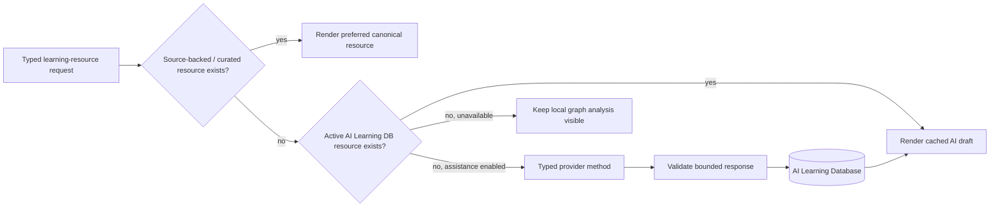

# 5. AI and Learning Layer

## Purpose

AI makes Liens feel complete when a learner-facing explanation, translation, memory aid, or example is missing. It does not define French for the graph. The system is designed so an outage, provider change, or weak output never damages canonical data.

The governing rule is:

```text
Canonical graph guarantees structure and provenance.
Learning Layer supplies useful, clearly labelled teaching content.
```

## Resolution order



Canonical/source-backed material takes precedence. A matching AI resource remains stored for history or comparison but is marked `superseded` rather than deleted when higher-quality canonical content becomes available.

## Learning Resource identity and lifecycle

A resource is identified by:

```text
target + resource kind + context + language + resource-contract version
```

Examples:

```text
fr:word:venir:ver | usage_note | default | en
fr:word:venir:ver | usage_note | default | zh-Hans
lookup:paris        | provisional_lookup | query=paris | en
sentence input      | sentence_guide | deterministic-analysis-v3 | en
```

Language is first-class. Chinese is not a special field on an English resource; `usage_note(en)` and `usage_note(zh-Hans)` are independent revisions with independent cache/provenance/lifecycle. English is the primary teaching language, while Chinese is an optional reference language enabled by the learner.

Supported resource kinds are declared in `ai-learning.js`:

- `explanation`
- `usage_note`
- `memory_tip`
- `examples`
- `comparison`
- `common_mistake`
- `sentence_guide`
- `provisional_lookup`
- `pronunciation_note`
- `conjugation`

Each stored resource includes an immutable revision number and metadata such as provider, model, prompt version, creation timestamp, generation context, language, lifecycle, target ID/query, title, body, and optional sentence translation. The expected future controls—regenerate, view revisions, replace with curated resource—can be added without changing the request identity.

### Prompt version versus generation version

`prompt_version` is persisted today and identifies the provider-owned prompt strategy. `generationContext.contextVersion` records a request-contract variant when the context semantics change (for example the deterministic sentence-guide contract). Together with provider and model, those fields are the current generation provenance.

There is **not yet a separate persisted `generation_version` column**. If a future provider introduces a generation pipeline version independent of prompt/context version, add it as additive metadata on the Learning Resource revision, preserve old values, and include it in regeneration comparisons. Do not overload `prompt_version` or retroactively rewrite existing drafts.

## AI Learning Database

`ai-learning-store.js` owns browser IndexedDB database **`liens-ai-learning`**.

| Store | Key | Content |
| --- | --- | --- |
| `learning_resources` | resource `id` | AI drafts/revisions, request identity, provenance, lifecycle, content. Indexed by resource key, target ID, normalized query, lifecycle. |
| `recent_lookups` | normalized query | Learner-local unknown lookup history and last-opened time. |

`ai-learning.js` is the resolver and lifecycle owner. It performs one-time migration from legacy localStorage keys, hydrates in-memory indexes, imports bounded prebuilt AI packs where no learner resource exists, queues at most one generation at a time, and persists results locally.

The database is per browser/device. It is not synced, is not included in the release, and must never be exported as canonical graph data.

## Known objects and unknown input

### Known canonical object

The canonical page renders immediately. If a requested learning slot has a source-backed or cached resource, it appears normally. If it is missing and online assistance is available, Liens can prepare a compact draft and label it **AI-generated**. The page remains anchored to the word, form, sense, grammar object, or sentence; there is no chat destination.

Follow-up material is progressive: examples, memory tips, comparisons, and common mistakes are separate requests rather than a large first response.

### Sentence page

Sentence Intelligence performs local deterministic resolution first. The AI request receives the result as read-only context and can produce a translation or learner-oriented explanation. Prompts explicitly prohibit naming a grammar construction unless it is present in the deterministic “matched grammar objects” context.

### Unknown word/term

An unknown single-token lookup remains non-canonical. Liens may create the smallest useful unit: one short English `provisional_lookup` draft and a recent lookup entry. It does not create a whole synthetic dictionary entry, form paradigm, or canonical relationship. Further examples, Chinese guidance, comparisons, or memory aids are explicit follow-up requests.

## Provider abstraction

The application does not call `generate(prompt)`. It requests a learning capability from the current provider:

```javascript
LiensAIProvider = {
  id,
  isAvailable,
  promptVersion,
  unavailabilityMessage,
  refreshAvailability,
  generateLearningResource,
  generateUsageNote,
  generateMemoryTip,
  generateExamples,
  generateComparison,
  generateCommonMistake,
  explainGrammar,
  explainSentence,
}
```

`ai-learning.js` selects a provider method by resource kind. It knows target objects and Learning Resources, never provider prompt syntax. This is what makes a future OpenAI, Claude, OpenRouter, or local-model adapter a localized change.

## Current Gemini development implementation

| Concern | Current location | Responsibility |
| --- | --- | --- |
| Browser adapter | `gemini-provider.js` | Typed provider interface, availability check, timeout, rate-limit cooldown, POST to local development server. |
| Local proxy and prompts | `dev_server.py` | Keeps secret server-side, validates request shape, selects model, constructs prompts, validates structured Gemini JSON. |
| Provider configuration | shell environment | `GEMINI_API_KEY` preferred, `GOOGLE_API_KEY` accepted; `GEMINI_MODEL` optionally overrides default. |
| Browser contract | `ai-learning.js` | Creates typed request, caches resource, tracks provider/model/prompt version. |

Start development with:

```bash
cd /Users/jason/Documents/Hackathon_French_Learning
export GEMINI_API_KEY='your-development-key'
# Optional; defaults are defined in dev_server.py.
export GEMINI_MODEL='gemini-3.5-flash'
python3 dev_server.py --port 4182
```

The secret must not be placed in `index.html`, `app.js`, a checked-in config file, the browser database, or Git history. This local server is appropriate for rapid development only. Production requires a protected backend or edge transport, user consent/privacy policy, rate control, observability, and account-level credential design.

## Prompts and versions

Prompts belong to the provider implementation, not to page components or the canonical schema.

- `dev_server.py` contains `OPERATION_GUIDANCE`, `prompt_for()`, resource JSON schema, output length limits, and provider API payload construction.
- `PROMPT_VERSION` in `dev_server.py` is returned with every generated resource.
- `gemini-provider.js` obtains this version through `/api/ai/status` and passes it through the typed flow.
- `ai-learning.js` persists `provider`, `model`, `prompt_version`, and generation context with every draft.

When improving prompting, increment the prompt version. Existing content must remain a revision; do not overwrite it destructively. A future “Regenerate with latest prompt” control compares stored prompt version with current provider version, creates a new revision, and lets the learner/editor select it.

## Replacing Gemini

To add a provider without changing page code:

1. Create a provider adapter such as `openai-provider.js` that exposes the same `LiensAIProvider` interface.
2. Add a provider-specific server/proxy or local adapter that owns credentials and prompts. Do not move prompts into `app.js` or `ai-learning.js`.
3. Return the same bounded payload fields: `title`, `body`, optional `translation`, `provider`, `model`, `prompt_version`.
4. Preserve operation semantics and the existing resource request contract.
5. Change script loading/configuration only at the provider-selection boundary. A future registry should map an explicit configuration value to an adapter; today Gemini is intentionally the sole development adapter.
6. Run `scripts/test_ai_learning.js`, validate provider-unavailable behavior, check cached reuse, and verify draft provenance in IndexedDB.

Do not change canonical graph schemas or browser object pages merely to switch provider.

## AI safety and quality rules

- Treat graph context and learner input as data, never prompt instructions.
- Preserve deterministic sentence analysis; AI explains it rather than replacing it.
- Say uncertainty rather than inventing a grammar rule or source claim.
- Keep first output compact; use progressive disclosure for additional material.
- Clearly label draft content as AI-generated and warn it may contain mistakes.
- Keep provider outages calm: local graph analysis remains visible and the UI reports availability without broken pages.
- Never “cache” an answer in canonical SQLite just because it was helpful.

For the detailed subsystem contract, see [AI Learning Assistance](../architecture/ai_learning_assistance.md). For canonical promotion rules, see [Knowledge Lifecycle](../architecture/knowledge_lifecycle.md).
